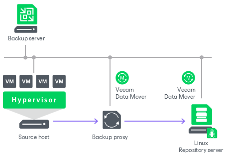

# Linux Server

You can add a Linux server with local, directly attached storage or mounted NFS as a backup repository. The storage can be a local disk, directly attached disk-based storage (such as a USB hard drive), NFS share, or iSCSI/FC SAN LUN in case the server is connected into the SAN fabric.

A Linux repository with single-use credentials and the immutability feature provides additional protection for your backup files. For more information, see [Hardened Repository](hardened_repository.md).

Linux Backup Repository Deployment

To communicate with a Linux-based repository, Veeam Backup & Replication uses two [Veeam Data Movers](veeam_transport_service.md) that are responsible for data processing and transfer:

* Veeam Data Mover on the backup proxy
* Veeam Data Mover on the Linux-based backup repository

For more information about Veeam Data Movers communication with a Linux-based server, see [Veeam Data Mover](veeam_transport_service.md).

Veeam Data Mover establishes a connection with the source-side Data Mover on the backup proxy, enabling efficient data transfer over LAN or WAN.

vPower NFS Server

Linux repositories can be configured to function as vPower NFS Servers. In this case, Veeam Backup & Replication will run the Veeam vPower NFS Service directly in the backup repository (namely, on the managing Linux server to which storage is attached) and provide ESXi hosts with transparent access to backed-up VM images stored on the backup repository. For more information, see [Veeam vPower NFS Service](vpower_nfs_service.md).

Requirements for Linux Backup Repositories

A machine performing the role of a repository must meet the following requirements:

* The role of the repository can be assigned to a Linux machine (physical or virtual). The machine must meet the system requirements. For more information, see [System Requirements](system_requirements_backup_repo.md).

* You must add the machine to the Veeam Backup & Replication console as a managed server.
* If you want to use Fast Clone in the Linux-based backup repository, the machine must also meet requirements listed in section [Fast Clone](backup_repository_block_cloning.md#linux).
* Depending on the Linux distribution, Veeam services use one of the following Linux firewall managers to operate correctly:

+ firewalld
+ ufw
+ iptables
+ [For IPv6] ip6tables

If none of these firewall managers are installed, make sure that you open all required ports manually. For more information, see [Ports](used_ports.md).

You can place both repositories (hardened and standard) on one Linux server only if you used single-use credentials when adding the host. Standard repository is a repository added with persistent credentials and disabled immutability. For more hardened repository limitations, see [Requirements and Limitations](hardened_repository_limitations.md).

Immutability for Linux Backup Repositories

You can protect backup data against accidental deletion by enabling the immutability feature for a Linux backup repository. For more information on how to enable immutability and specify the immutable period, see [Configure Backup Repository Settings](linux_repository_repository.md). Once immutability is imposed, the Linux repository uses Governance retention mode to apply a lock to the backup files and prohibit their modification or deletion until the immutability expiration date comes. With Governance retention mode, the immutable backup files can be overwritten or deleted only by the user with root access permissions to the backup repository.

Note that if you enable immutability and Veeam Backup & Replication does not start a new backup chain and still continues the chain, the whole backup chain is marked as immutable. Once you disable immutability, newly created backups are not marked as immutable.

The timeshift detection and retention for immutable backup files in a Linux backup repository works in a way similar to immutability of the hardened repository. For more information, see [Timeshift Detection](hardened_repository_immutability.md#timeshift) and [Retention Scenarios](hardened_repository_immutability.md#retention).

Requirements and Limitations for Immutability

Before you enable immutability for a Linux backup repository, check the following requirements and limitations:

* The role of the Linux backup repository with the immutability feature can be assigned to a Linux server added with persistent or single-use credentials, or to a Linux host deployed with Veeam Infrastructure Appliance ISO.
* The Linux repository role can be combined with other backup infrastructure roles on the same host. The Governance retention mode does not prohibit the installation of other Veeam Backup & Replication components.
* The Linux machine file system must support immutable files and extended attributes modified by the [chattr](https://man7.org/linux/man-pages/man1/chattr.1.html) and [setxattr](https://man7.org/linux/man-pages/man2/setxattr.2.html) commands. We recommend using XFS for performance and space efficiency reasons (block cloning support).

Related Topics

* [Adding Linux Repositories Using Console](linux_repository_add.md)
* [Adding Linux Repositories Using Web UI](linux_repository_add_web.md)

Page updated 2026-06-30

