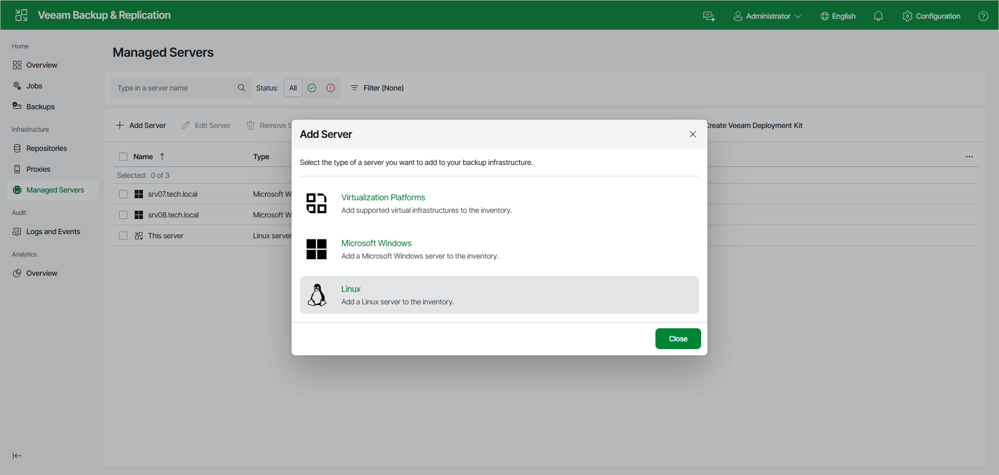

# Step 1. Launch New Linux Server Wizard

In this article

To launch the New Linux Server wizard, do the following:

1. In the management pane, click the Managed Servers node.
2. Click Add Server on the ribbon and select Linux.

Page updated 10/7/2025

Page content applies to build 13.0.1.1071
