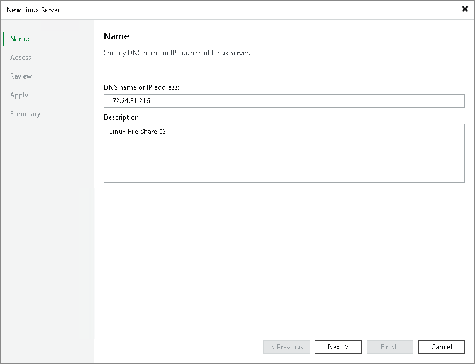

# Step 2. Specify Server Name or Address

At the Name step of the wizard, specify an address and description for the Linux server.

1. Enter a full DNS name,or IPv4 or IPv6 address of the Linux server. Note that you can use IPv6 addresses only if IPv6 communication is enabled as described in section [IPv6 Support](ipv6.md).
2. Provide a description for future reference. The default description contains information about the user who added the server, date and time when the server was added.

