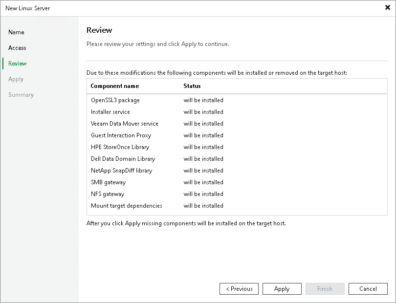

# Step 4. Review Components

At the Review step of the wizard, review what Veeam Backup & Replication components are already installed on the server and what components will be installed.

1. Review the components.
2. Click Apply to add the Linux server to the backup infrastructure.

