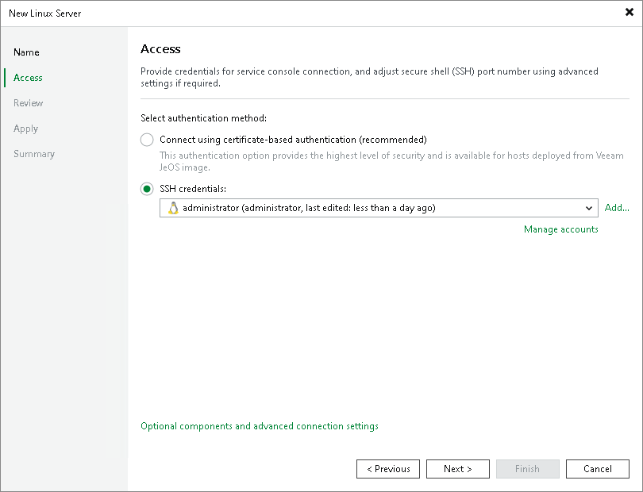
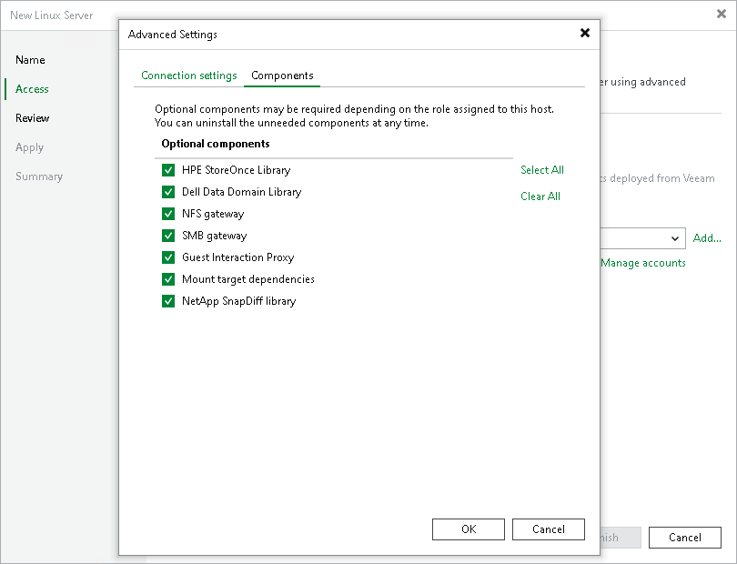
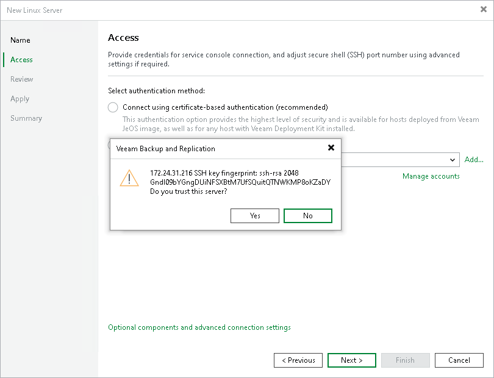

# Step 3. Specify Credentials and SSH Settings

In this article

At the Access step of the wizard, provide credentials for the service console connection and adjust secure shell (SSH) port number.

1. Select the authentication method:

* Connect using certificate-based authentication — select this option if the Linux server is a host deployed from Veeam JeOS image.

With this method, no user name or password is required; authentication is performed using certificates.

* SSH credentials — specify credentials for the Linux server and additional SSH connection settings.

From the SSH credentials list, select SSH credentials for the account that has permissions described in section [Permissions](required_permissions.md#rphost). You can select a credentials record that uses the password authentication method or credentials record that uses the Identity/Pubkey authentication method.

|  |
| --- |
| Note |
| The account you selected must have the home directory created on the Linux server. |

If you have not set up credentials beforehand, click the Manage accounts link or click Add on the right to add the credentials. For more information, see [Credentials Manager](credentials_manager.md).

To add a Linux server that you want to use as a hardened repository, click Add and select Single-use credentials for hardened repository. For more information about preparing a Linux server and setting up credentials, see [Adding Hardened Repositories](hardened_repository_add.md#step2).

|  |
| --- |
| Note |
| If you add a Linux server with single-use credentials, consider the following:   * The folder with the repository must be accessible for accounts with user permissions (and not only root). * SSH connection is necessary only for the deployment of Veeam Data Mover or transport service. The transport service will be used to communicate with backup infrastructure components without the SSH connection. For security purposes, after adding the Linux server, you can disable SSH connection for the user account used to connect to the Linux server. If you can work with the server from the console, disable SSH connection for the server itself. |

1. To configure SSH settings and optional components, click Optional components and advanced connection settings. This option becomes available after you have entered your credentials. In the Advanced Settings window:

* At the Connection settings tab, you can specify the ports and data transfer options:

1. In the Service console connection section, specify an SSH timeout. By default, the SSH timeout is set to 20000 ms. If a task targeted at the Linux server is inactive after the specified timeout, Veeam Backup & Replication will automatically terminate the task.
2. In the Data transfer options section, specify connection settings for file copy operations. Provide a range of ports that will be used as transmission channels between the source host and target host (one port per task). By default, Veeam Backup & Replication uses port range 2500-3300. If the virtual environment is not large and data traffic will not be significant, you can specify a smaller range of ports, for example, 2500-2509 to run 10 concurrent tasks at the same time.

Port 6162 is opened by default. It is a port used by [Veeam Data Mover](veeam_transport_service.md).

|  |
| --- |
| Note |
| If you want to open these ports only for certain firewalld zones, you can specify the required zones in the configuration files. For instructions, see the [Before You Begin](linux_server_before_begin.md) section. |

1. [For Linux server deployed outside NAT] In the Preferred TCP connection role section, select the Run server on this side check box. In the NAT scenario, the outside client cannot initiate a connection to the server on the NAT network. As a result, services that require initiation of the connection from outside can be disrupted. With this option selected, you will be able to overcome this limitation and initiate a "client-server" connection — that is, a connection in the direction of the Linux server.

The option applies if one of the following roles is assigned to the server: source VMware backup proxy in backup or replication scenarios, source repository in the backup copy scenario.

You can also change the SSH port over which you want to connect to the Linux server. For this, click the Manage accounts link and edit the account used to connect to the Linux server.

* At the Components tab, you can select the required components to be installed depending on the role you plan to assign to the Linux server in the backup infrastructure. Clear the check boxes of the components you do not need. By default, Veeam Backup & Replication installs all components from the list.

If the role of the Linux server is changed, you can uninstall or reinstall the components later at the Access step of the Edit Server wizard.

|  |
| --- |
| Note |
| Depending on the selected components (possible roles), the Linux server may require additional packages that must be installed before you add the server to the backup infrastructure. For details, see requirements for the role assigned. For example, see [Mount Server System Requirements](system_requirements.md#mount). |

1. When you add a Linux server, Veeam Backup & Replication saves a fingerprint of the Linux host SSH key to the configuration database. During every subsequent connection to the server, Veeam Backup & Replication uses the saved fingerprint to verify the server identity and avoid the man-in-the-middle attack.

To let you identify the server, Veeam Backup & Replication displays the SSH key fingerprint:

+ If you trust the server and want to connect to it, click Yes.
+ If you do not trust the server, click No. Veeam Backup & Replication will display an error message, and you will not be able to connect to the server.

|  |
| --- |
| Note |
| When you update an SSH key on a server, this server becomes unavailable in the Veeam Backup & Replication console. To make the server available again, acknowledge the new SSH key at the SSH Connection step of the [Edit Server](edit_server.md) wizard. |

Page updated 12/5/2025

Page content applies to build 13.0.1.1071
