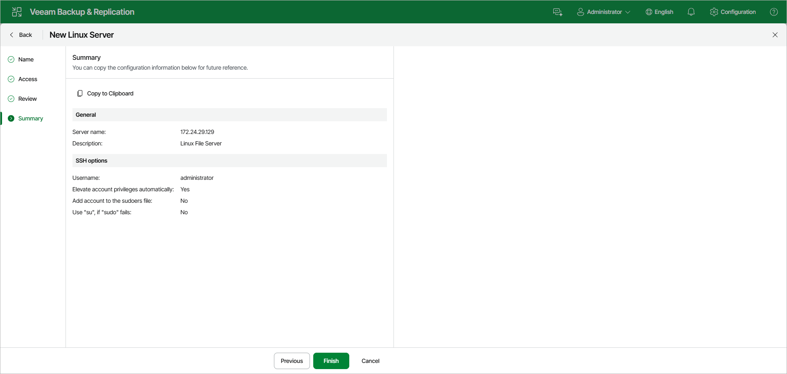

# Step 5. Finish Working with Wizard

In this article

At the Summary step of the wizard, review the details of the Linux server. Click Finish to add the Linux server to the backup infrastructure. Veeam Backup & Replication will install and configure all required components.

Page updated 10/7/2025

Page content applies to build 13.0.1.1071
