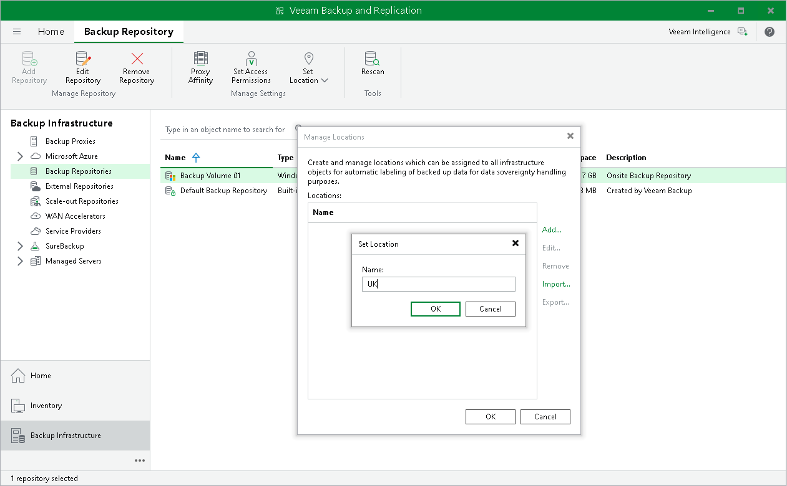
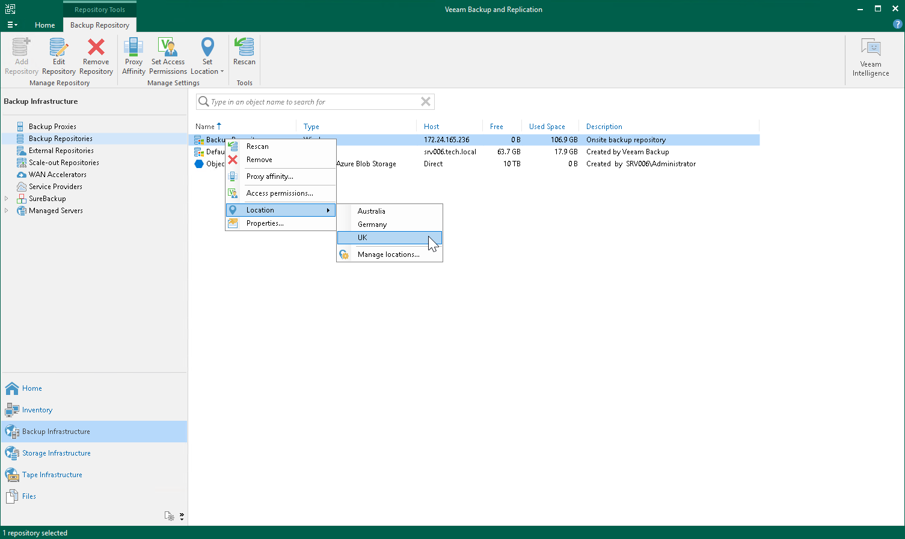

# Creating and Assigning Locations to Infrastructure Objects

You can create a list of locations in Veeam Backup & Replication and assign locations to infrastructure objects. If you assign a location to a root infrastructure host (SCVMM) or vCenter server, it will be applied to all child hosts (clusters, HV hosts or ESXi hosts). You can also assign the location to a child host.

To create a location:

1. In the Inventory or Backup Infrastructure view, right-click the infrastructure object and select Location > Manage locations.
2. In the Manage Locations window, click Add.
3. In the Name field, enter a name of the location.

To assign a location to an infrastructure object, in the Inventory or Backup Infrastructure view, right-click the infrastructure object and select Location > <Location name>. If the location is not in the list, select Location > Manage Locations and add the location to the list.

|  |
| --- |
| Note |
| When assigning a location to a scale-out backup repository, the location will be global for all extents. If you add an extent whose location differs from the global location, it will be changed in favor of the location of the scale-out repository. |

