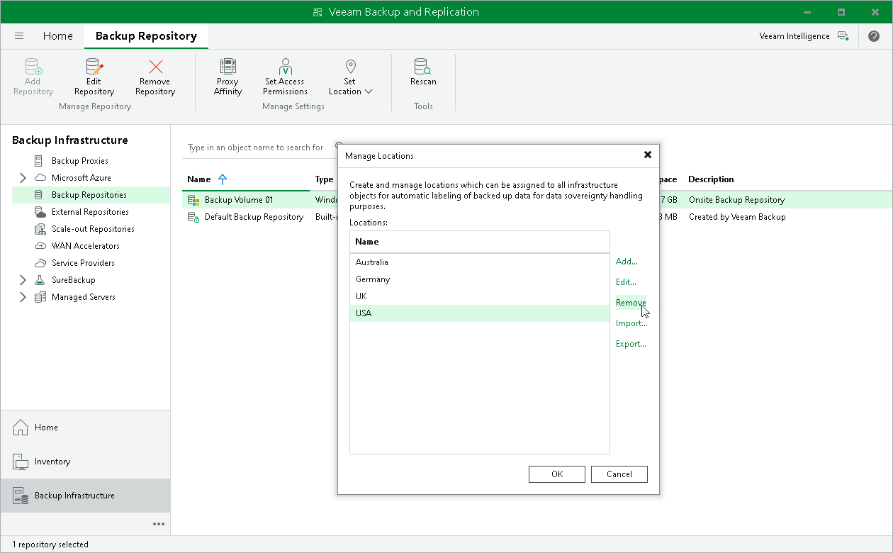

# Deleting Locations

You can delete a location from the locations list, for example, if you no longer host infrastructure objects in this location.

To delete a location:

1. In the Inventory or Backup Infrastructure view, right-click the infrastructure object and select Location > Manage locations.
2. In the Manage Locations window, select the location and click Remove. If the location is currently assigned to some infrastructure objects, Veeam Backup & Replication will display a warning with the list of objects that belong to this location. Click Yes to confirm the location deletion.

