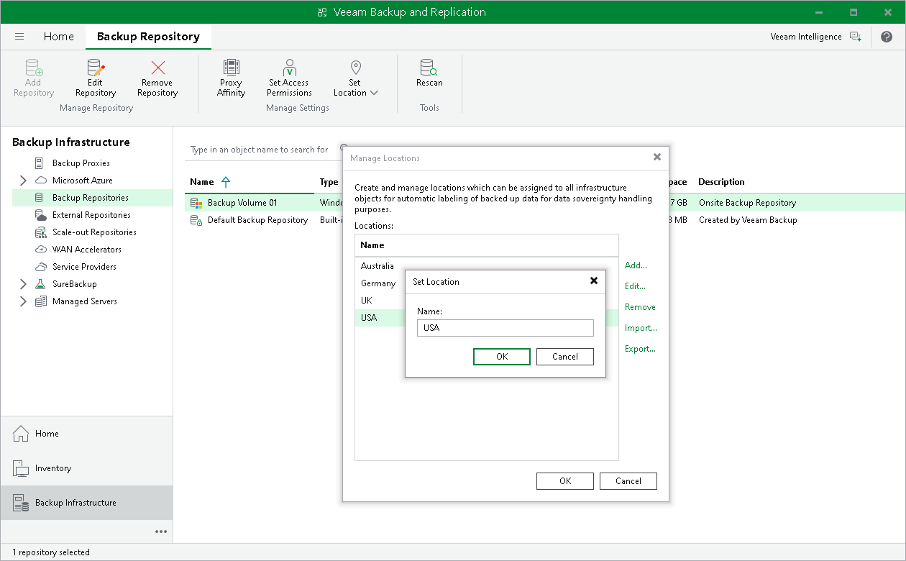

# Editing Locations

In this article

You can edit a location in the locations list, for example, if you want to change the location name.

To edit a location:

1. In the Inventory or Backup Infrastructure view, right-click the infrastructure object and select Location > Manage locations.
2. In the Manage Locations window, select the location and click Edit.
3. In the Name field, change the location name as required.

Page updated 9/23/2025

Page content applies to build 13.0.1.1071
