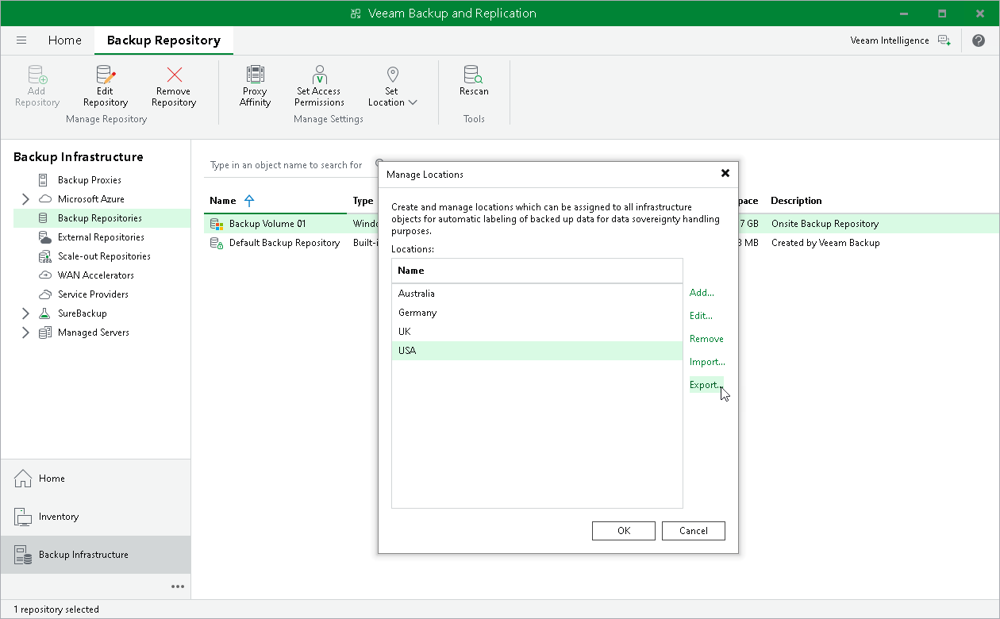

# Exporting and Importing Locations List

You can export and import the list of locations to/from a file of XML format.

The import and export functionality facilitates the process of locations creation and maintenance. For example, if you need to set up the same list of locations throughout the whole backup infrastructure, you can create a list of locations on one backup server manually, export this list to an XML file, and then import the list on other backup servers and machines running the Veeam Backup & Replication console.

|  |
| --- |
| Tip |
| If you delete and recreate a location, Veeam Backup & Replication will create an object with a new ID in the database and consider it as a new location. Thus, to preserve the uniqueness of the location, use the location export/import operations. |

To export the locations list:

1. In the Inventory or Backup Infrastructure view, right-click an infrastructure object and select Location > Manage locations.
2. In the Manage Locations window, click Export and specify a name of the XML file to which the locations list must be exported.

To import the locations list:

1. In the Inventory or Backup Infrastructure view, right-click an infrastructure object and select Location > Manage locations.
2. In the Manage Locations window, click Import and browse to the XML file from which the locations list must be imported.

