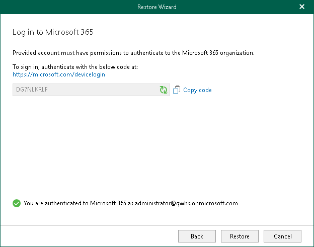

# Step 3. Log In to Microsoft 365

This step is only available if you have selected the Modern Authentication (one-time password) option at the [previous step](select_authentication_method_mfa_one_click.md#auth_code) of the wizard.

At this step of the wizard, log in to your Microsoft 365 organization.

To log in to the Microsoft 365 organization, do the following:

1. Click Copy code to copy an authentication code.

Keep in mind that a code is valid for 15 minutes. You can click Refresh to request a new code from Microsoft.

1. Click the Microsoft Identity platform authentication server link.

A web browser window opens.

1. On the Sign in to your account webpage, paste the code that you have copied and sign in to Microsoft Identity platform.

Make sure to log in with the user account that has both the ApplicationImpersonation and the Exchange Administrator roles. For more information, see [this Microsoft article](https://docs.microsoft.com/en-us/exchange/applicationimpersonation-role-exchange-2013-help) and [this Veeam KB article](https://www.veeam.com/kb4708).

1. Return to the Restore Wizard window and click Restore.

