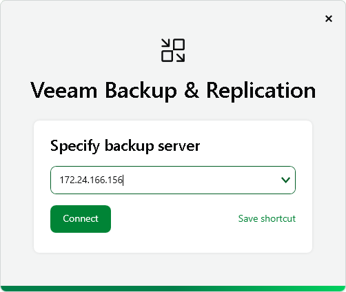
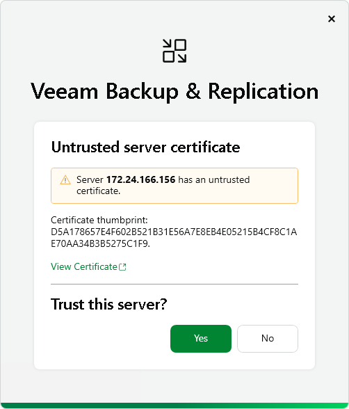
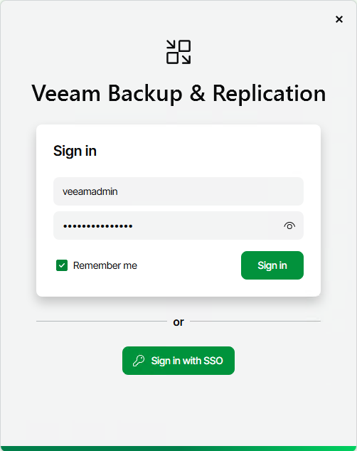
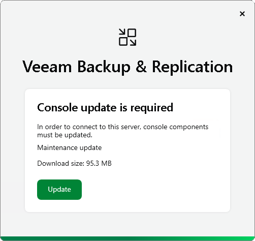

# Logging in to Veeam Backup & Replication

To log in to Veeam Backup & Replication, you must open the Veeam Backup & Replication console and specify connection settings to access the backup server.

1. To open the Veeam Backup & Replication console, do one of the following:

+ Double-click the console icon on the desktop.
+ From the Microsoft Windows Start menu, select All Programs > Veeam > Veeam Backup & Replication Console.
+ Use the Microsoft Windows search to find the Veeam Backup & Replication Console program on the computer.

1. At the Specify backup server step, type the name or IP address of the backup server or select it from the list of recent connections. After you enter you backup server IP address or name, you may use Save shortcut to save the shortcut for your backup server connection to the desktop. You can create as many shortcuts as you need.

|  |
| --- |
| Note |
| If you create a shortcut for a connection, the credentials for this connection will be stored in the Windows Credentials Manager. The credentials are saved after the first successful login. |

Click Connect.

1. At the Server certificate step, select if you trust the server certificate. Click Yes.

1. At the Sign in step, enter the credentials of the user account that you want to use to connect to the backup server. To learn more, see [Configuring Users](configuring_users_console.md).

The user account must be added to the Local Users group on the backup server or a group of domain users who have access to the backup server.

Select Remember me if you do not want to enter the credentials again the next time you sign in on this backup server.

If SAML authentication is enabled, click Sign in with SSO and specify credentials to log in to the SSO service used by your organization. For more information, see [SAML Authentication](identity_provider.md).

1. If necessary, click Update at the Console update step.

1. Click Sign in.

If multi-factor authentication (MFA) is enabled, after you click Connect, you will receive instructions on how to set up MFA or have to enter a 6-digit confirmation code generated in the mobile authenticator application. For more information, see [Multi-Factor Authentication](mfa.md).

Related Topics

* [Veeam Backup & Replication Console UI](vbr_ui.md)
* [Veeam Backup & Replication Web UI](vbr_web_console.md)
* [Installing Veeam Backup & Replication Console](install_console.md)

