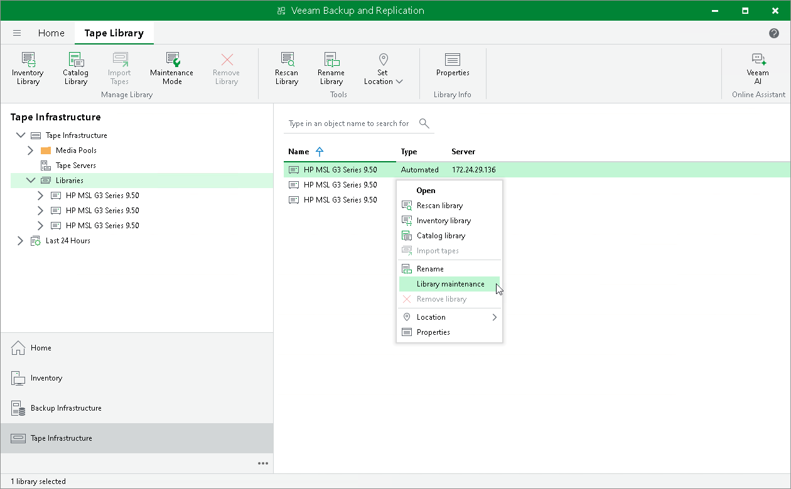

# Switching Libraries to Maintenance Mode

In this article

There can be situations where you need to lock a tape library or a standalone tape drive from being used by Veeam Backup & Replication, for example, to provide maintenance services to them.

Before switching the tape library to the maintenance mode, consider the following:

* You cannot enable the maintenance mode for the tape library if jobs that use it are running.
* After you enable the maintenance mode for the tape library, all jobs that use it will fail with an error when starting.

To switch a tape library to the maintenance mode:

1. Open the Tape Infrastructure view.
2. Navigate to the list of tape libraries under Libraries.
3. Select a tape library you want to switch to the maintenance mode and click Maintenance Mode on the ribbon. Alternatively, you can right-click the selected tape library and select Library maintenance from the drop-down menu. Or you can open the tape library properties and select the Maintenance mode check box.

The tape library will stay in the maintenance mode until you manually disable it by performing the same actions like you did when enabling it.

After you disable the maintenance mode, Veeam Backup & Replication automatically starts a discovery job. However, it does not apply to standalone tape drives. To discover standalone drives, manually rescan the tape server, as described in section [Rescanning Tape Servers](rescan_tape_server.md).

Page updated 6/14/2024

Page content applies to build 13.0.1.1071
