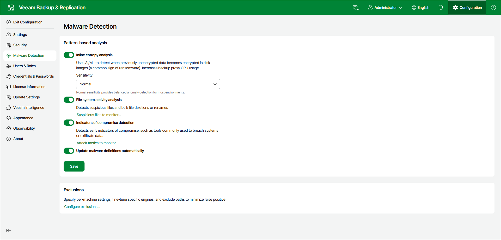
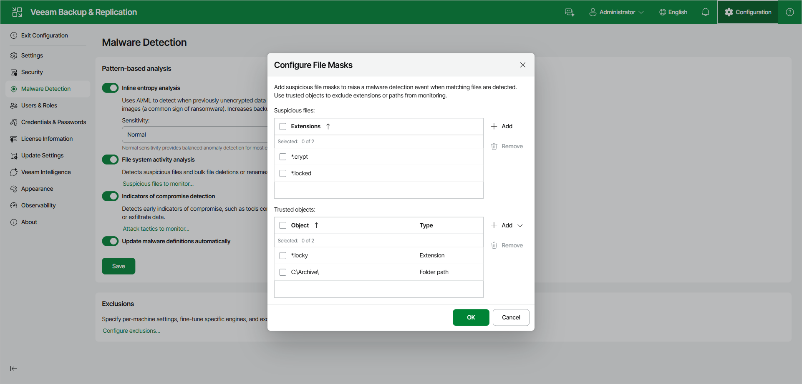
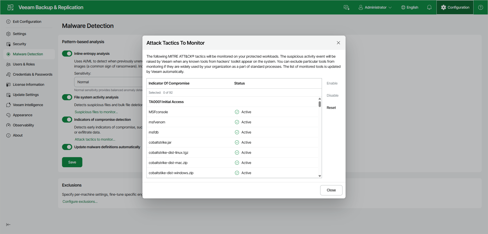

# Configuring Malware Detection Using Web UI

To configure malware detection in the Veeam Backup & Replication web UI, do the following:

1. In the top right corner, click Configuration and open the Malware Detection page.
2. To detect data encryption, set the Inline entropy analysis toggle to On and specify the scan sensitivity. The default value is Normal. For more information, see [Inline Scan](malware_detection_data_blocks.md). In the console, this setting is on the Encryption Detection tab.
3. To detect suspicious files, multiple deleted files, and multiple extension changes, set the File system activity analysis toggle to On. To manage the monitored file masks and trusted objects, click Suspicious files to monitor. For more information, see [Known Suspicious Files and Extensions](malware_detection_guest_index_suspicious_files.md). In the console, these settings are on the File Detection tab.
4. Set the Indicators of compromise detection toggle to On. To review the monitored tools, click Attack tactics to monitor. For more information, see [Indicators of Compromise](malware_detection_guest_index_ioc.md).
5. Set the Update malware definitions automatically toggle to On. Veeam Backup & Replication connects to the Veeam Update Server (vbr.butler.veeam.com) once a day, by default at 12:00 AM, and downloads the latest version of the SuspiciousFiles.xml file.
6. Click Save.

|  |
| --- |
| Note |
| The Veeam Backup & Replication web UI requires a licensed installation of Veeam Backup & Replication and is not available in the Community Edition. |

Configuring Suspicious Files to Monitor

In the Configure File Masks window, you can add suspicious file masks and exclude trusted objects from monitoring. For more information about the list of suspicious files and extensions, see [Known Suspicious Files and Extensions](malware_detection_guest_index_suspicious_files.md).

To add a suspicious file mask, do the following:

1. Next to the Suspicious files list, click Add.
2. Specify a file extension or a file name with or without an extension, and click OK. You can use the \* and ? wildcard characters.

To add a trusted object, do the following:

1. Next to the Trusted objects list, click Add and select Extension or Path.
2. Specify a file extension or a path, and click OK. Wildcards are not supported in paths.

Attack Tactics to Monitor

In the Attack Tactics To Monitor window, Veeam Backup & Replication lists the monitored indicators of compromise based on the MITRE ATT&CK® framework, grouped by tactic. To stop monitoring a tool, select it and click Disable. To resume monitoring, click Enable. To restore the default set, click Reset.

Page updated 2026-07-28

