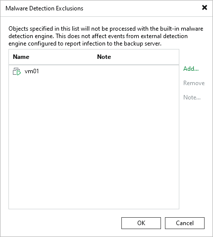

# Malware Exclusions

To exclude specific machines from the malware detection scan, perform the following steps:

1. Open the Malware Detection Exclusions window by doing one of the following:

* From the main menu, select Global Exclusion > Malware Exclusions.
* Open the Inventory view, select the Malware Detection node, and click Exclusions on the ribbon.

1. Click Add and select VMware vSphere VMs, Hyper-V VMs, or Physical and cloud machines.
2. Select the object from the list and click Add.
3. Click Note to provide a description for future reference.
4. Click OK.

You can also add the machine to the exclusions list when you mark it as clean. For more information, see [Managing Malware Status](malware_detection_managing_status.md).

|  |
| --- |
| Note |
| Malware exclusions are applied only to guest indexing data scan and inline scan and do not affect scan using Veeam Threat Hunter, third-party antivirus software, or YARA. |

