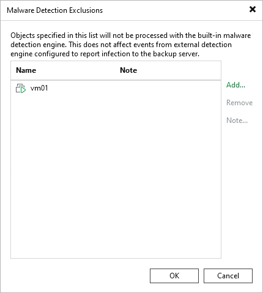

# Managing Malware Exclusions Using Console

To exclude specific machines from the malware detection scan, do the following in the Veeam Backup & Replication console:

1. Open the Malware Detection Exclusions window by doing one of the following:

* From the main menu, select Global Exclusion > Malware Exclusions.
* Open the Inventory view, select the Malware Detection node, and click Exclusions on the ribbon.

1. Click Add and select VMware vSphere VMs, Hyper-V VMs, or Physical and cloud machines.
2. Select the object from the list and click Add.
3. Click Note to provide a description for future reference.
4. Click OK.

You can also add the machine to the exclusions list when you mark it as clean. For more information, see [Managing Malware Status](malware_detection_managing_status.md).

The Malware Detection Exclusions window includes a Manage advanced settings in the Web UI link. Click it to open the Veeam Backup & Replication web UI, where you can turn individual detection engines on or off and exclude specific paths per machine. For more information, see [Managing Malware Exclusions Using Web UI](malware_detection_exclusions_web.md).

|  |
| --- |
| Note |
| Malware exclusions are applied only to the guest indexing data scan and the inline scan, and they do not affect scans using Veeam Threat Hunter, 3rd party antivirus software, or YARA. |

Page updated 2026-07-30

