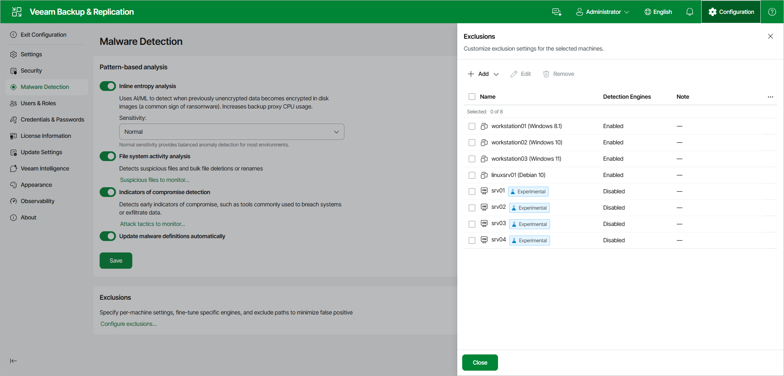
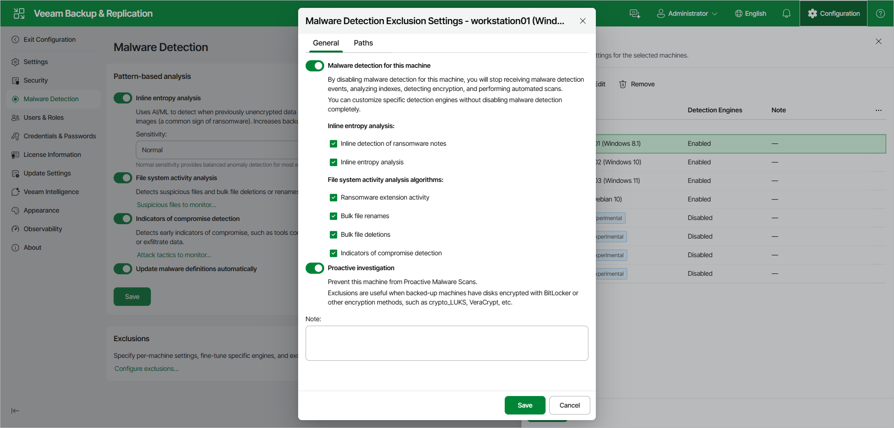
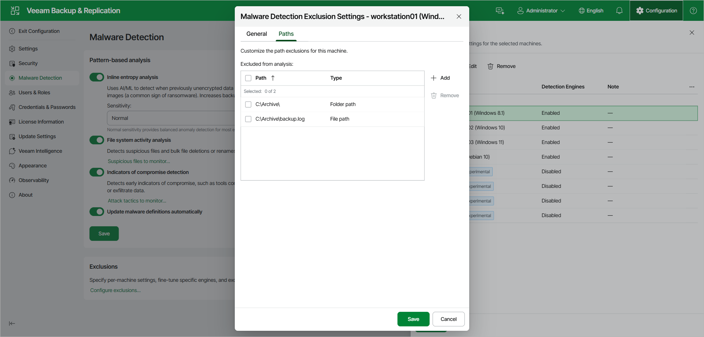

# Managing Malware Exclusions Using Web UI

In the Veeam Backup & Replication web UI, you can customize malware detection settings for individual machines. For each machine, you can turn specific detection engines on or off and exclude specific files and folders from file analysis-based engines.

|  |
| --- |
| Note |
| Per-machine exclusions are available only in the Veeam Backup & Replication web UI and apply to indexing-based scans. To exclude machines from the malware detection scan in the Veeam Backup & Replication console, see [Managing Malware Exclusions Using Console](malware_detection_exclusions_console.md). |

Adding Machines to Exclusions

To customize malware detection settings for specific machines, do the following in the Veeam Backup & Replication web UI:

1. In the top right corner, click Configuration and open the Malware Detection page.
2. In the Exclusions section, click Configure exclusions.
3. Click Add and select the platform of the machines that you want to customize: VMware vSphere, Microsoft Hyper-V, or Computers.
4. Select the machines and click Add.
5. Select a machine in the list and click Edit to customize its detection engines and path exclusions.

If you add a single machine, the edit dialog opens automatically. If you add multiple machines, select one and click Edit. To edit multiple machines at once, use PowerShell.

Customizing Detection Engines

To customize the detection engines for a machine, open the General tab and do the following:

1. Ensure that the Malware detection for this machine toggle is set to On. To stop malware detection for the machine, set this toggle to Off.
2. To turn individual detection engines on or off, select or clear the corresponding check boxes. The engines are grouped under Inline entropy analysis (Inline detection of ransomware notes, Inline entropy analysis) and File system activity analysis algorithms (Ransomware extension activity, Bulk file renames, Bulk file deletions, Indicators of compromise detection). To determine which detection engine to disable, check the type of the corresponding malware detection event.
3. Set the Proactive investigation toggle to On or Off to include or exclude the machine from proactive malware scans. Exclude a machine if its disks are encrypted, for example, with BitLocker, crypto\_LUKS, or VeraCrypt. Also exclude Linux machines if your backup infrastructure has no Linux mount server, which proactive scans of Linux machines require. You can also exclude a machine that you do not want scanned during automatic scans.
4. In the Note field, optionally add a description for future reference.
5. Click Save.

|  |
| --- |
| Note |
| The Malware detection for this machine toggle and the individual engine check boxes differ as follows:   * If you set the Malware detection for this machine toggle to Off, all current and future detection engines are disabled for the machine. * If you keep the toggle set to On and clear specific engine check boxes, only those engines are disabled. Detection engines added in future releases can be enabled after an upgrade. |

Excluding Paths

To exclude a specific file or folder from the file system activity analysis for the machine, do the following:

1. Open the Paths tab and click Add.
2. Specify the path to the file or folder and click OK. Wildcards are not supported. For example:

|  |
| --- |
| C:\Folder\  C:\Folder\file.name |

A path that ends with a slash excludes the folder and all its content. A path to a specific file excludes only that file.

|  |
| --- |
| Note |
| Consider the following:   * Global machine exclusions are configured in the Veeam Backup & Replication console. * Path exclusions apply to indexing-based scans. |

Page updated 2026-07-30

