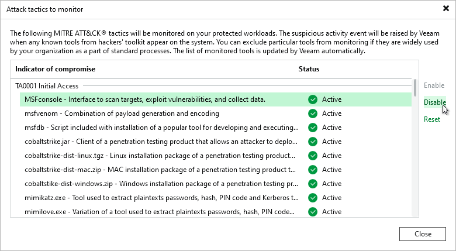
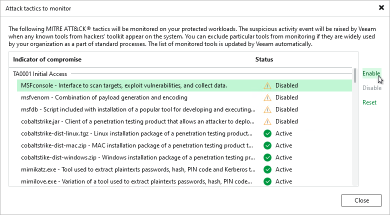

# Indicators of Compromise

Indicators of compromise are non-malware programs. However, their unexpected presence on a system can indicate a security risk. Indicators of compromise are specified in the SuspiciousFiles.xml file. They are selected from and categorized using the [MITRE ATT&CK Matrix](https://attack.mitre.org/).

To detect indicators of compromise, the Veeam Data Analyzer Service compares guest indexing data from two restore points with the SuspiciousFiles.xml file. The later restore point will be compared with the earliest restore point from the same 25-hour period. If there is no restore point, the scan will use the most recent restore point from the same 30-day period. If an indicator of compromise is present only in the later restore point, a malware detection event is created.

|  |
| --- |
| Note |
| The indicators of compromise list cannot be customized. To receive new indicators of compromise, select the Update malware definitions automatically check box. For more information, see [Configuring Guest Indexing Data Scan](malware_detection_guest_index_enable.md). |

You can exclude specific indicators of compromise from monitoring. To disable an indicator of compromise, do the following:

1. From the main menu, select Malware Detection > File Detection and click Attack tactics to monitor.
2. Select the indicator of compromise you want to disable.
3. Click Disable.

To include an indicator of compromise in monitoring again, do the following:

1. From the main menu, select Malware Detection > File Detection and click Attack tactics to monitor.
2. Select the indicator of compromise you want to enable.
3. Click Enable.

To restore default settings for all indicators of compromise, click Reset.

