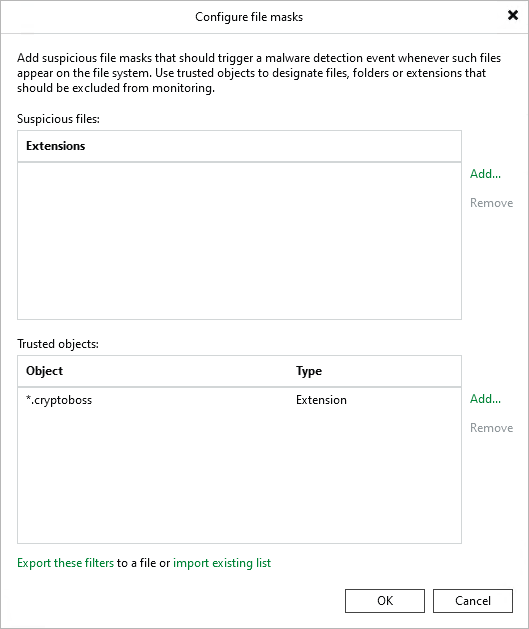
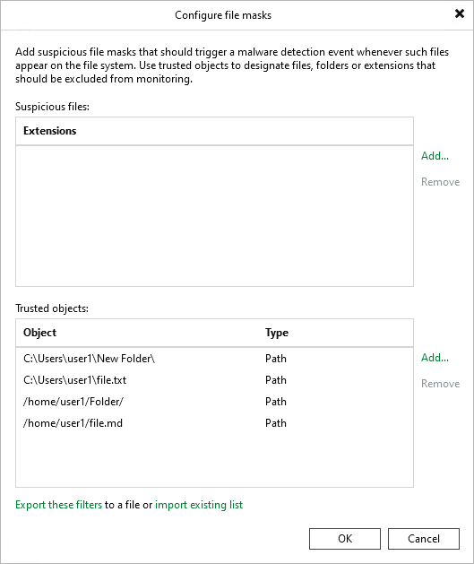
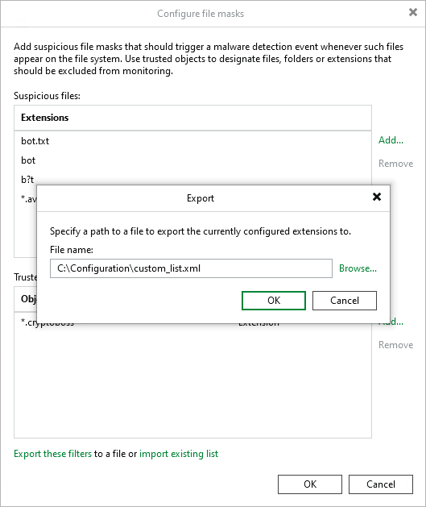
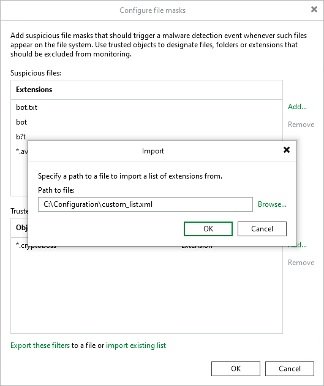

# Known Suspicious Files and Extensions

To detect suspicious files and extensions commonly used by malware, the Veeam Data Analyzer Service compares the guest indexing data of a restore point with the SuspiciousFiles.xml file. If files have extensions or names that match any in the SuspiciousFiles.xml file, a malware detection event is created.

|  |
| --- |
| Note |
| Do not edit the SuspiciousFiles.xml file directly. You can customize the list of suspicious files and extensions in the following ways:   * [Add custom suspicious files and extensions](#addingsuspiciousfiles). * [Exclude suspicious files and extensions](#excludingsuspiciousfiles). * [Exclude files and folders](#excludingsuspiciousfolders). * [Export and import custom lists](#exportingandimportinglists). |

Adding Custom Suspicious Files and Extensions

To add custom files and extensions that should be marked as suspicious, perform the following steps:

1. From the [main menu](vbr_ui.md), select Malware Detection > File Detection and click Suspicious files to monitor.
2. Click Add next to the Suspicious files field.
3. Specify a file extension or a file name with or without extension. You can also use \* and ? wildcard characters. For example:

|  |
| --- |
| bot.txt  bot  b?t  \*.avi |

|  |
| --- |
| Note |
| Malware detection scan is case-insensitive. You do not need to add extensions or file names with different cases, for example, bot and Bot. |

1. Click OK.

Excluding Suspicious Files and Extensions

To exclude a file name or file extension listed in the SuspiciousFiles.xml file and ignore it during the scan, do the following:

1. From the [main menu](vbr_ui.md), select Malware Detection > File Detection and click Suspicious files to monitor.
2. Click Add > Extension next to the Trusted objects field.
3. Specify a file name or file extension as it is listed in the SuspiciousFiles.xml file (the FileMask tag). For example:

|  |
| --- |
| \*.cryptoboss |

1. Click OK.

|  |
| --- |
| Note |
| You can also add files and extensions to the trusted list from the Event Details window. For more information, see [Viewing Malware Detection Events](malware_detection_view_events.md). |

Excluding Files and Folders

To ignore a specific file or a folder during the scan, do the following:

1. From the [main menu](vbr_ui.md), select Malware Detection > File Detection and click Suspicious files to monitor.
2. Click Add > Path next to the Trusted objects field.
3. Specify a path to the file or folder. For example:

|  |
| --- |
| C:\Users\user1\New Folder\  C:\Users\user1\file.txt  /home/user1/Folder/  /home/user1/file.md |

1. Click OK.

|  |
| --- |
| Note |
| Consider the following:   * A path to a folder must include the last slash (" /" or "\" ) symbol. * A Linux path must start with a slash ("/") symbol. * A Windows path must start with a drive letter. For example, "C:\". * UNC paths are not supported. * Wildcard characters are not supported. * Excluding files and folders is applied only to the following malware activity types:  * Known suspicious files and extensions * Renamed files * Deleted files |

Exporting and Importing Custom Lists

You can export and import the list of custom files and extensions to and from a file in the XML format.

To export the list, do the following:

1. From the [main menu](vbr_ui.md), select Malware Detection > File Detection and click Suspicious files to monitor.
2. Click Export these filters.
3. Click Browse and select the folder to save the list.
4. Specify the name of the file and click Save.
5. Click OK.

To import the list, do the following:

1. From the [main menu](vbr_ui.md), select Malware Detection > File Detection and click Suspicious files to monitor.
2. Click Import existing list.

|  |
| --- |
| Important |
| The import operation will override files and extensions you specified earlier. It is recommended to export your current list before you import a new one. |

1. Click Browse and select the folder where the file is located.
2. Select the file and click Open.
3. Click OK.

A valid XML Schema for the list must contain the following elements:

Exporting and Importing Custom Lists

| Element | Description |
| RansomwareExclusions | Root element. |
| Includes | Child element of the RansomwareExclusions element. Contains custom files and extensions that must be marked as suspicious. Can be empty. |
| Excludes | Child element of the RansomwareExclusions element. Contains files and extensions listed in the SuspiciousFiles.xml file that must be ignored during the guest indexing data scan. Can be empty. |
| Item (Includes/Excludes) | Child element of the Includes or Excludes element. Each Item contains a file extension or a file name with or without extension that must be marked as suspicious or ignored.  Consider the following:   * File names and file extensions can include \* and ? wildcard characters. * File names and file extensions must not contain the following characters: <, >, :, ", \, /, |. * Use &amp; to escape an ampersand (&).   Note that files and extensions you want to exclude must be listed in the SuspiciousFiles.xml file. |
| IgnoredPaths | Child element of the RansomwareExclusions element. Contains specific files and folders that must be ignored during the guest indexing data scan. Can be empty. |
| Item (IgnoredPaths) | Child element of the IgnoredPaths element. Each Item contains a path to the specific file or folder that must be ignored.  The element also has a specific Type attribute. Possible values:   * Absolute — Absolute paths   Consider the following:   * A path to the folder must include the last slash (" /" or "\" ) symbol.  * File and folder names can contain spaces.  * Paths must not contain the following characters: <, >, ", |,\*,?. * Use &amp; to escape an ampersand (&). |

Example:

|  |
| --- |
| <RansomwareExclusions>     <Includes>         <Item>bot.txt</Item>         <Item>\*.avi</Item>         <Item>bot1&amp;2.txt</Item>     </Includes>     <Excludes>         <Item>\*.cryptoboss</Item>     </Excludes>     <IgnoredPaths>         <Item Type="Absolute">C:\Users\user1\New Folder\</Item>         <Item Type="Absolute">C:\Users\user1\file.txt</Item>         <Item Type="Absolute">/home/user1/Folder/</Item>         <Item Type="Absolute">/home/user1/file.md</Item>     </IgnoredPaths>  </RansomwareExclusions> |

