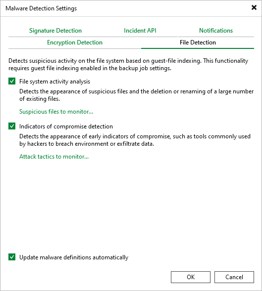

# File Detection

In the File Detection tab, you can configure guest indexing data scan settings. For more information, see [Configuring Guest Indexing Data Scan](malware_detection_guest_index_enable.md).

