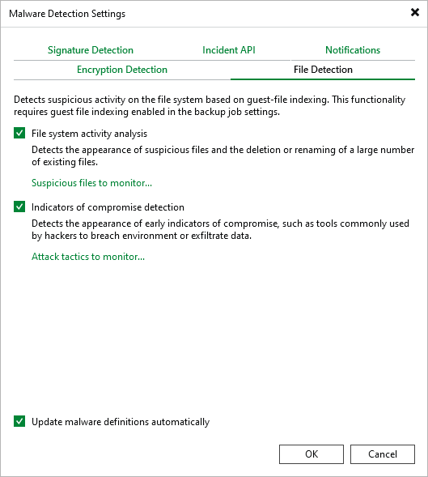
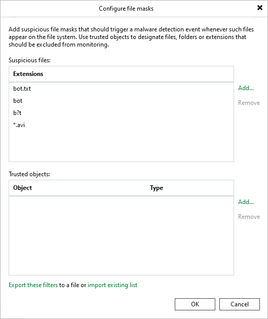
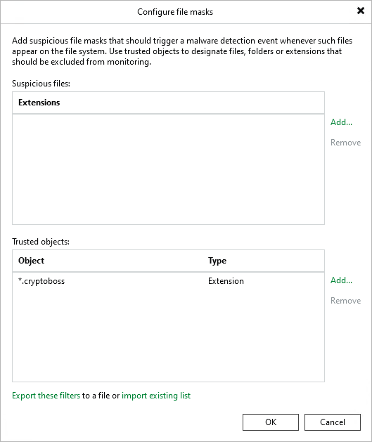
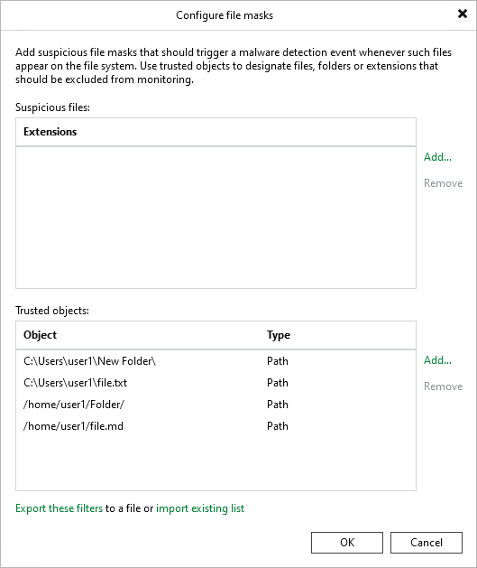
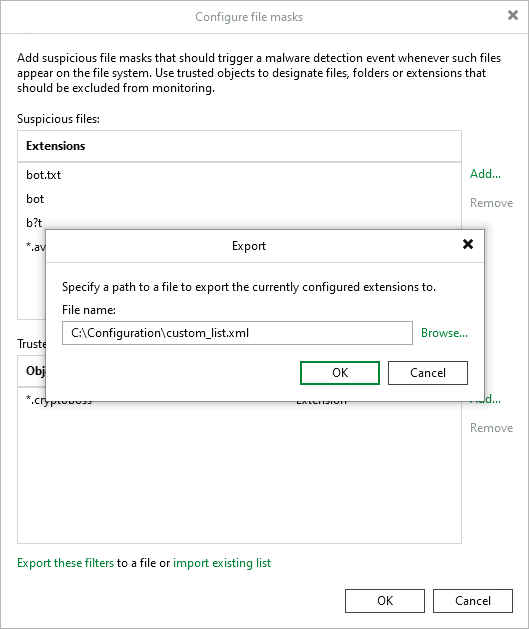
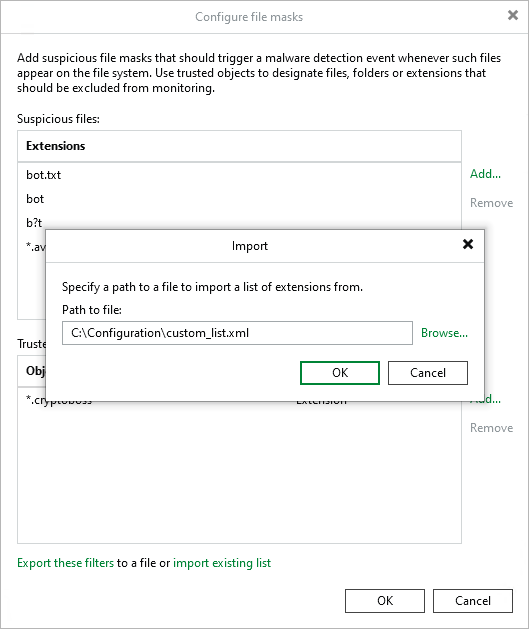
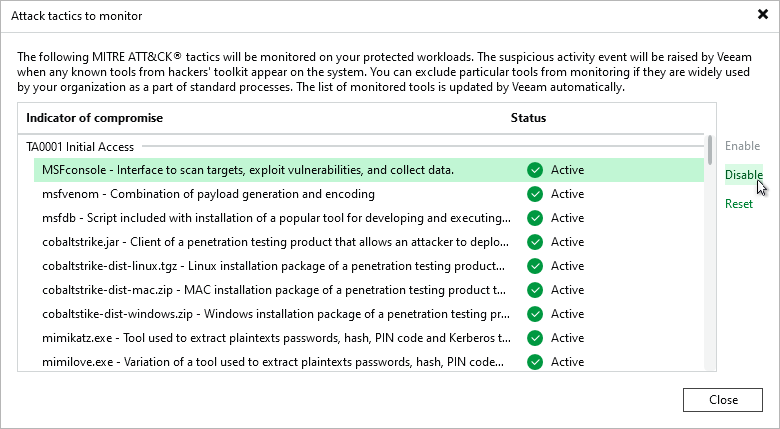
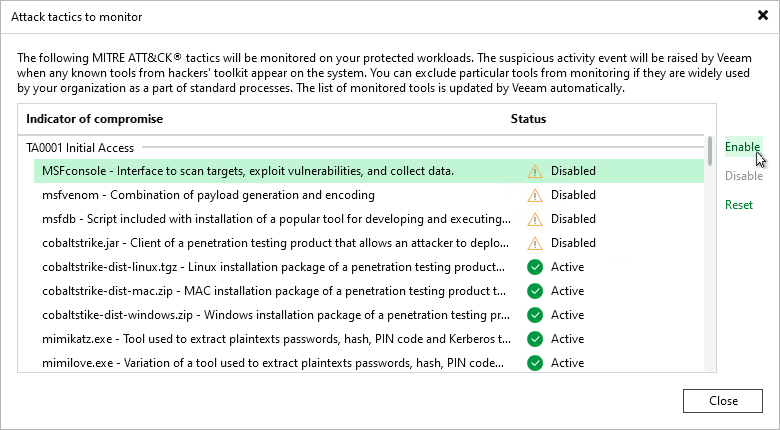

# File Detection

In the File Detection tab, you can enable and configure the [guest indexing data scan](malware_detection_guest_index.md), manage the list of suspicious files and extensions, and choose which indicators of compromise to monitor. In the Veeam Backup & Replication web UI, the same settings are available under File system activity analysis.

To enable the guest indexing data scan, do the following:

1. From the main menu, select Malware Detection.
2. In the File Detection tab, select the File system activity analysis check box. This option enables the scan for known suspicious files and extensions, multiple deleted files, and multiple extension changes. For more information, see the following sections:

* [Known Suspicious Files and Extensions](malware_detection_guest_index_suspicious_files.md)
* [Multiple Deleted Files](malware_detection_guest_index_deleted_files.md)
* [Multiple Extension Changes](malware_detection_guest_index_renamed_files.md)

|  |
| --- |
| Note |
| This functionality is enabled by default when you install Veeam Backup & Replication 13. |

1. Make sure that you enable guest file system indexing for the required backup job. For more information, see the following sections related to specific platforms:

* VMware vSphere — [Specify Guest Processing Settings](backup_job_vss_vm.md)
* Microsoft Hyper-V — [Specify Guest Processing Settings](backup_job_vss_hv.md)
* Veeam Agent for Windows — [Specify Guest Processing Settings](agent_job_vss.md)
* Veeam Agent for Linux — [Specify Guest Processing Settings](agent_job_guest.md)

To scan guest indexing data for indicators of compromise, select the Indicators of compromise detection check box. For more information, see [Indicators of Compromise](malware_detection_guest_index_ioc.md).

To keep the list of suspicious files and extensions as well as indicators of compromise up to date, select the Update malware definitions automatically check box. Veeam Backup & Replication will communicate with the Veeam Update Server (vbr.butler.veeam.com) daily and download the latest version of the SuspiciousFiles.xml file. By default, this occurs once a day at 12:00 AM.

|  |
| --- |
| Note |
| If your backup server has limited internet access, you can manually update the SuspiciousFiles.xml file. For more information, see [this Veeam KB article](https://www.veeam.com/kb4514). |

To manage the list of suspicious files and extensions, from the main menu select Malware Detection > File Detection and click Suspicious files to monitor.

Adding Custom Suspicious Files and Extensions

To add custom files and extensions that should be marked as suspicious, do the following:

1. Click Add next to the Suspicious files field.
2. Specify a file extension or a file name with or without extension. You can also use \* and ? wildcard characters. For example:

|  |
| --- |
| bot.txt  bot  b?t  \*.avi |

|  |
| --- |
| Note |
| The malware detection scan is case-insensitive. You do not need to add extensions or file names with different cases, for example, bot and Bot. |

1. Click OK.

Excluding Suspicious Files and Extensions

To exclude a file name or file extension listed in the SuspiciousFiles.xml file and ignore it during the scan, do the following:

1. Click Add > Extension next to the Trusted objects field.
2. Specify a file name or file extension as it is listed in the SuspiciousFiles.xml file. For example:

|  |
| --- |
| \*.cryptoboss |

1. Click OK.

|  |
| --- |
| Note |
| You can also add files and extensions to the trusted list from the Event Details window. For more information, see [Viewing Malware Detection Events](malware_detection_view_events.md). |

Excluding Files and Folders

To ignore a specific file or a folder during the scan, do the following:

1. Click Add > Path next to the Trusted objects field.
2. Specify a path to the file or folder. For example:

|  |
| --- |
| C:\Users\user1\New Folder\  C:\Users\user1\file.txt  /home/user1/Folder/  /home/user1/file.md |

1. Click OK.

|  |
| --- |
| Note |
| Consider the following:   * A path to a folder must include the last slash ("/" or "\") symbol. * A Linux path must start with a slash ("/") symbol. * A Windows path must start with a drive letter. For example, "C:\". * UNC paths are not supported. * Wildcard characters are not supported. * Excluding files and folders applies only to the following malware activity types: known suspicious files and extensions, renamed files, and deleted files. |

Exporting and Importing Custom Lists

You can export and import the list of custom files and extensions to and from a file in the XML format.

To export the list, do the following:

1. Click Export these filters.
2. Click Browse and select the folder to save the list.
3. Specify the name of the file and click Save.
4. Click OK.

To import the list, do the following:

1. Click Import existing list.

|  |
| --- |
| Important |
| The import operation will override files and extensions you specified earlier. It is recommended to export your current list before you import a new one. |

1. Click Browse and select the folder where the file is located.
2. Select the file and click Open.
3. Click OK.

A valid XML schema for the list must contain the following elements:

Exporting and Importing Custom Lists

| Element | Description |
| RansomwareExclusions | Root element. |
| Includes | Child element of the RansomwareExclusions element. Contains custom files and extensions that must be marked as suspicious. Can be empty. |
| Excludes | Child element of the RansomwareExclusions element. Contains files and extensions listed in the SuspiciousFiles.xml file that must be ignored during the guest indexing data scan. Can be empty. |
| Item (Includes/Excludes) | Child element of the Includes or Excludes element. Each Item contains a file extension or a file name with or without extension that must be marked as suspicious or ignored.  Consider the following:   * File names and file extensions can include \* and ? wildcard characters. * File names and file extensions must not contain the following characters: <, >, :, ", \, /, |. * Use &amp; to escape an ampersand (&).   Note that files and extensions you want to exclude must be listed in the SuspiciousFiles.xml file. |
| IgnoredPaths | Child element of the RansomwareExclusions element. Contains specific files and folders that must be ignored during the guest indexing data scan. Can be empty. |
| Item (IgnoredPaths) | Child element of the IgnoredPaths element. Each Item contains a path to the specific file or folder that must be ignored.  The element also has a specific Type attribute. Possible values:   * Absolute — Absolute paths   Consider the following:   * A path to the folder must include the last slash ("/" or "\") symbol. * File and folder names can contain spaces. * Paths must not contain the following characters: <, >, ", |,\*,?. * Use &amp; to escape an ampersand (&). |

Example:

|  |
| --- |
| <RansomwareExclusions>     <Includes>         <Item>bot.txt</Item>         <Item>\*.avi</Item>         <Item>bot1&amp;2.txt</Item>     </Includes>     <Excludes>         <Item>\*.cryptoboss</Item>     </Excludes>     <IgnoredPaths>         <Item Type="Absolute">C:\Users\user1\New Folder\</Item>         <Item Type="Absolute">C:\Users\user1\file.txt</Item>         <Item Type="Absolute">/home/user1/Folder/</Item>         <Item Type="Absolute">/home/user1/file.md</Item>     </IgnoredPaths>  </RansomwareExclusions> |

Attack Tactics to Monitor

You can exclude specific indicators of compromise from monitoring. For more information about indicators of compromise, see [Indicators of Compromise](malware_detection_guest_index_ioc.md).

To disable an indicator of compromise, do the following:

1. From the main menu, select Malware Detection > File Detection and click Attack tactics to monitor.
2. Select the indicator of compromise you want to disable.
3. Click Disable.

To enable an indicator of compromise, do the following:

1. From the main menu, select Malware Detection > File Detection and click Attack tactics to monitor.
2. Select the indicator of compromise you want to enable.
3. Click Enable.

To restore default settings for all indicators of compromise, click Reset.

Page updated 2026-07-17

