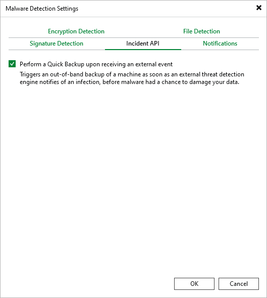

# Veeam Incident API

You can run a quick backup session when Veeam Backup & Replication gets a Veeam Incident API response that triggers a malware detection event. To do this, perform the following steps:

1. From the main menu, select Malware Detection > Incident API.
2. Select the Perform a Quick Backup upon receiving an external event check box.

|  |
| --- |
| Note |
| If there are several machines with malware detection events triggered by the Veeam Incident API, quick backup will process these machines one by one. |

For more information on quick backup, see [Quick Backup](quick_backup.md). For more information on Incident API methods, see [Veeam Backup & Replication REST API Reference](https://helpcenter.veeam.com/references/vbr/13/rest/1.3-rev0/tag/Malware-Detection).

