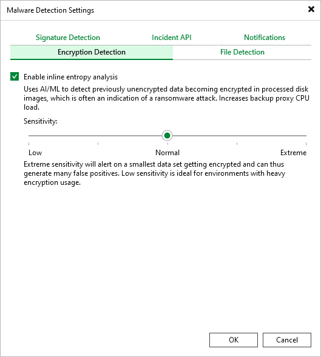

# Encryption Detection

In the Encryption Detection tab, you can enable the inline scan. In the Veeam Backup & Replication web UI, the same setting is available under Inline entropy analysis. For more information about the inline scan, see [Inline Scan](malware_detection_data_blocks.md).

To enable the inline scan, do the following:

1. From the main menu, select Malware Detection.
2. In the Encryption Detection tab, select the Enable inline entropy analysis check box.
3. Specify the scan sensitivity. The default value is Normal.

Page updated 2026-07-17

