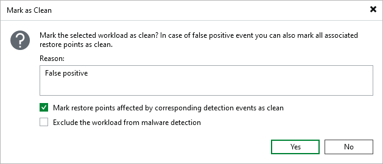
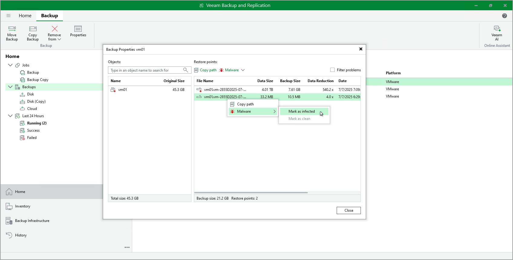

# Managing Malware Status

Veeam Backup & Replication allows you to manage the malware status of machines and specific restore points.

Marking Machines as Clean

All machines marked by malware detection as suspicious or infected can be found in the Inventory view under the Malware Detection node.

If you cleaned the machine of malware or the malware detection event was false positive, you can mark the machine as clean. To do this, perform the following steps:

1. Right-click one or more machines and select Mark as clean. Alternatively, click Mark as Clean on the ribbon.
2. If machines were cleaned of malware, specify the reason and click Yes. The malware status of the machine will be automatically updated. Previous restore points will be left with the Suspicious or Infected status. All next restore points will not be marked as suspicious or infected unless a new malware detection event is created.
3. If the malware detection event was false positive, specify the reason, select the Mark restore points affected by corresponding detection events as clean check box, and click Yes. The malware status of the machine will be automatically updated. Previous restore points will be marked as clean. Next restore points will not be marked as suspicious or infected unless a new malware detection event is created.

|  |
| --- |
| Note |
| You can exclude specific files and extensions from scans to avoid repeated false positive malware detection events. For more information, see [Known Suspicious Files and Extensions](malware_detection_guest_index_suspicious_files.md#excludingsuspiciousfiles). |

If you want to disable next malware detection scans for machines that you mark as clean, select the Exclude the workload from malware detection check box. The machines will be added to the exclusions list. For more information, see [Malware Exclusions](malware_detection_exclusions.md).

Managing Malware Status of Specific Restore Points

If you know that a specific machine is infected but the malware detection scan did not detect any suspicious activity, you can manually change the malware status of the specific restore point. To do this, perform the following steps:

1. Open the Home view and navigate to the Backups node.
2. Right-click the job name and select Properties. Alternatively, select the job name and click Properties on the ribbon.
3. [Optional] If all backup data is backed up to a single storage and you want to change the malware status of the specific restore point for a specific machine, select the machine in the Objects window.
4. In the right column, right-click the restore point and select Malware > Mark as infected.

If you know that a specific restore point is not infected, you can manually change its malware status. To do this, perform the following steps:

1. Open the Home view and navigate to the Backups node.
2. Right-click the job name and select Properties. Alternatively, select the job name and click Properties on the ribbon.
3. [Optional] If all backup data is backed up to a single storage and you want to change the malware status of the specific restore point for a specific machine, select the machine in the Objects window.
4. In the right column, right-click the restore point and select Malware > Mark as clean.

|  |
| --- |
| Note |
| If you set the malware status of the restore point manually, it will have a higher priority. The result of the malware detection scan will not affect the malware status of this restore point even if the malware detection event is created. |

Resolving Malware Status Automatically

You can additionally scan restore points marked as Suspicious after guest indexing data scan or inline scan with Veeam Threat Hunter or third-party antivirus software. If malware activity is not detected, the Veeam Analyzer Service can automatically mark the restore point and the machine as Clean. For more information on how to configure this setting, see [Signature Detection](malware_detection_signature_detection.md).

