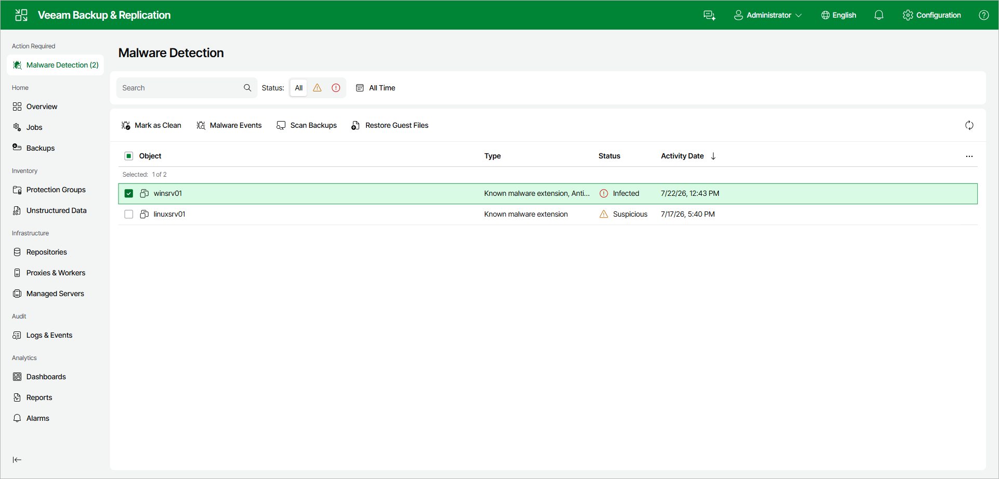
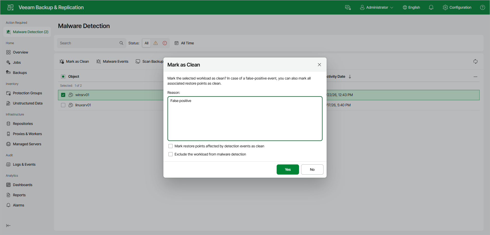

# Managing Malware Status Using Web UI

When malware detection marks machines as Suspicious or Infected, a Malware Detection item appears in the left navigation pane of the Veeam Backup & Replication web UI under Action Required. Click it to open the Malware Detection view, which lists the flagged machines with their Type, Status, and Activity Date. When no machines require attention, this item is hidden.

To review malware detection events at any time, open the Malware Events tab of the Logs and Events view. To configure malware detection settings, use the Configuration menu. For more information, see [Configuring Malware Detection Using Web UI](malware_detection_configuring_web.md).

Marking Machines as Clean

If you cleaned a machine of malware or the malware detection event was a false positive, you can mark the machine as clean. To do this, do the following in the Veeam Backup & Replication web UI:

1. In the left navigation pane, click Malware Detection.
2. Select one or more machines in the list.
3. Click Mark as Clean on the toolbar. Alternatively, right-click the machine and select Mark as Clean.
4. In the Mark as Clean window, specify the reason. If the malware detection event was a false positive, select the Mark restore points affected by detection events as clean check box. To stop scanning the machine during subsequent sessions, select the Exclude the workload from malware detection check box.
5. Click Yes.

After you mark a machine as clean, its malware status is updated. Previous restore points keep the Suspicious or Infected status unless you chose to mark them as clean, and subsequent restore points are not marked as suspicious or infected unless a new malware detection event is created.

To turn off specific detection engines or exclude paths for a machine, use per-machine exclusions. For more information, see [Managing Malware Exclusions Using Web UI](malware_detection_exclusions_web.md).

Page updated 2026-07-16

