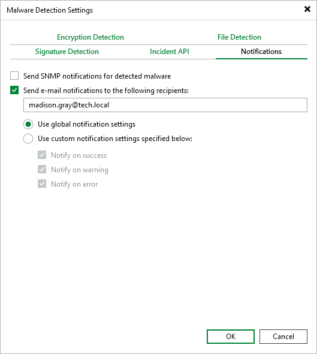

# Notifications

In this article

You can receive SNMP traps or email notifications about created malware detection events. To do this, perform the following steps:

1. From the main menu, select Malware Detection > Notifications.
2. If you want to receive SNMP traps, select the Send SNMP notifications for detected malware check box. For more information, see [Configuring Global SNMP Settings Using Console](general_snmp_settings.md).
3. If you want to receive email notifications, select the Send e-mail notifications to the following recipients check box and specify one or several email addresses separated with a semicolon. You can use global notification settings or specify custom notification settings as required. For more information, see [Configuring Global Email Notification Settings](general_email_notifications.md).

Veeam Backup & Replication sends the following email notifications:

* Daily report is sent when the Veeam Data Analyzer Service restarts the malware detection session (once a day at 12:00 AM) or when you restart the service manually. The report contains consolidated data about all malware detection events that were created within the last 24 hours.
* Immediate report is sent each time a malware detection event is created. If several events were created within 10 seconds, one report with consolidated data will be sent.

Page updated 7/25/2025

Page content applies to build 13.0.1.1071
