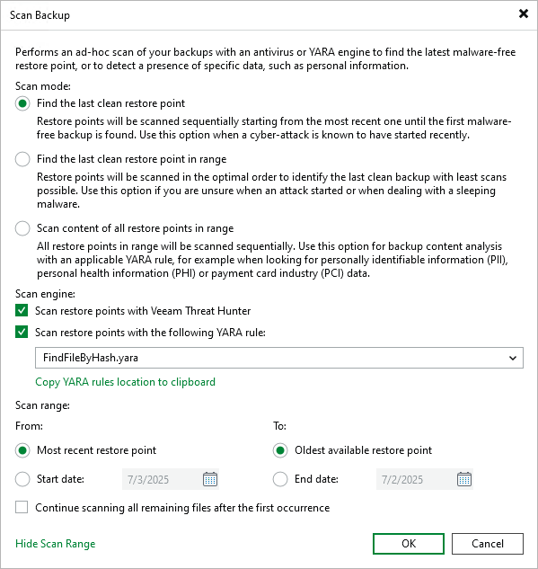

# Configuring Scan Backup Session

To run the Scan Backup session, do the following:

1. Open the Scan Backup window by doing one of the following:

* Open the Inventory view and select the Malware Detection node. Select the required machine and click Scan Backup on the ribbon. Alternatively, right-click the machine and select Scan backup.
* Open the Home view and select the Backups node. Select the job and required machine, and click Scan Backup on the ribbon. Alternatively, right-click the machine and select Scan backup.

1. Specify the scan mode you want to use. You can perform one of the following operations:

* Find the last clean restore point.
* Find the last clean restore point in range.
* Scan content of all restore points in range.

1. Specify the scan engine you want to use:

* To use Veeam Threat Hunter as a scan engine, select the Scan restore points with Veeam Threat Hunter check box. For more information, see [Veeam Threat Hunter for Scan Backup](malware_detection_scan_backup_veeam_threat_hunter.md).

If you use third-party antivirus software as an alternative to Veeam Threat Hunter, select the Scan restore points with the existing antivirus software check box. For more information, see [Antivirus Scan for Scan Backup](malware_detection_scan_backup_antivirus.md).

* To use YARA as a scan engine, select the Scan restore points with the following YARA rule check box and specify the YARA file located in the Veeam Backup & Replication product folder. For more information, see [YARA Scan for Scan Backup](malware_detection_scan_backup_yara.md).
* To use YARA and Veeam Threat Hunter or third-party antivirus software simultaneously, select both check boxes.

1. Configure the scan range. You can specify the following options:

* Scan all restore points, from the most recent restore point to the oldest one.
* Scan restore points created during a specific time period.

To continue the Scan Backup session after the first malware or the first piece of specific information is found, select the Continue scanning all remaining files after the first occurrence check box.

1. Click OK.

