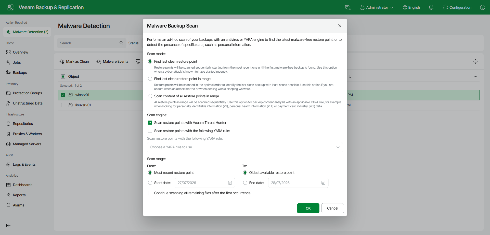

# Scanning Backups Using Web UI

You can run a Scan Backup session from the Malware Detection view. For more information about Scan Backup and its scan engines, see [Scan Backup](malware_detection_scan_backup.md).

|  |
| --- |
| Important |
| When malware detection marks machines as Suspicious or Infected, the Malware Detection view appears in the left navigation pane of the Veeam Backup & Replication web UI under Action Required. When no machines require attention, this view is hidden.  In the web UI, you can only run a Scan Backup session when a machine or backup has already been marked as Suspicious or Infected. To scan a backup that has not been flagged, use the Veeam Backup & Replication console. For more information, see [Scanning Backups Using Console](malware_detection_scan_backup_configure.md). |

To run a Scan Backup session, do the following:

1. In the left navigation pane, click Malware Detection.
2. Select one or more machines, file shares, or object storage backups and click Scan Backups.
3. In the Malware Backup Scan window, select the scan mode:

* Find last clean restore point.
* Find last clean restore point in range.
* Scan content of all restore points in range.

1. Select the scan engine:

* To use Veeam Threat Hunter, select the Scan restore points with Veeam Threat Hunter check box. For more information, see [Veeam Threat Hunter for Scan Backup](malware_detection_scan_backup_veeam_threat_hunter.md).
* To use YARA, select the Scan restore points with the following YARA rule check box and select a YARA rule. For more information, see [YARA Scan for Scan Backup](malware_detection_scan_backup_yara.md).

1. Configure the scan range. You can scan all restore points or restore points within a specific date range.

To continue the scan after the first occurrence is found, select the Continue scanning all remaining files after the first occurrence check box.

1. Click OK.

Page updated 2026-07-28

