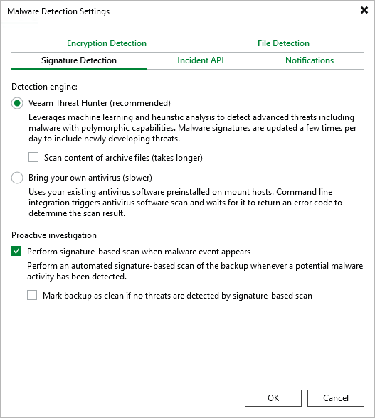

# Signature Detection

You can configure default engines to scan restore points. To do this, perform the following steps:

1. From the main menu, select Malware Detection > Signature Detection.
2. Specify a detection engine:

* If you want to use Veeam Threat Hunter, select Veeam Threat Hunter. To include additional archive and compound files, such as RAR, ZIP, CHM, installers, and so on in the scan list, select the Scan content of archive files check box. Note that this option may increase scan time. For more information about Veeam Threat Hunter, see [Veeam Threat Hunter for Scan Backup](malware_detection_scan_backup_veeam_threat_hunter.md) and [Veeam Threat Hunter for Secure Restore](secure_restore_veeam_threat_hunter.md).
* If you want to use third-party antivirus software, select Bring your own antivirus. For more information about antivirus scan, see [Antivirus Scan for Scan Backup](malware_detection_scan_backup_antivirus.md) and [Antivirus Scan for Secure Restore](secure_restore_antivirus.md).

1. To additionally scan restore points marked as Suspicious after guest indexing data scan or inline scan, select the Perform signature-based scan when malware event appears check box. In this case, a Scan Backup session will run automatically:

+ If malware activity is detected,  the Veeam Analyzer Service will create a new malware detection event and mark the restore point and the machine as Infected.
+ If malware activity is not detected, the Veeam Analyzer Service will create a new malware detection event with the Informative status. After that, you can mark a restore point and a machine as Clean. For more information, see [Managing Malware Status](malware_detection_managing_status.md).
+ If a restore point contains encrypted disks, such disks cannot be mounted and will not be scanned. In this case, a scan session will display mount errors in the log file and will be finished with Warning. The Veeam Analyzer Service will not create any malware detection events.

For more information on how to exclude machines with encrypted disks from the signature-based scan scope, see [this KB article](https://www.veeam.com/kb4803).

To automatically mark a restore point and a machine as Clean, select the Mark backups as clean if no threats are detected by signature-based scan check box. In this case, a malware detection event with the Informative status will not be created and a Clean event will be created instead.

|  |
| --- |
| Note |
| Consider the following when you use a proactive signature-based scan:   * Only the following Suspicious malware detection events trigger a scan session:  + File encryption + Ransomware notes and .onion files + Known malware extensions + Bulk file renaming + Bulk file deletion  * The mount server must be compatible with the guest OS file system to perform a signature-based scan for the guest indexing data properly. * Maximum 5 scan sessions can be run simultaneously per mount server. * Scanning backups kept in object storage repositories may lead to additional costs. * Signature-based scan is not supported for backups kept in Cloud Connect repositories. * It is recommended to double-check restore points and machine automatically marked as Clean as these events may be false positive. * If you selected third-party antivirus software as a detection engine but it is not installed on the mount server or the configuration file is improperly configured, a scan session will fail. A failed session will be retried three times. |

