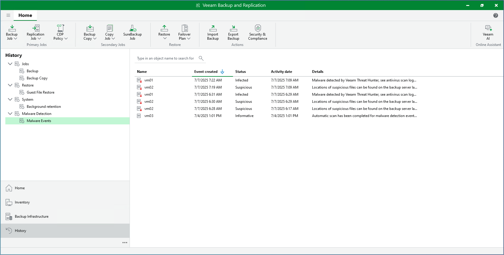
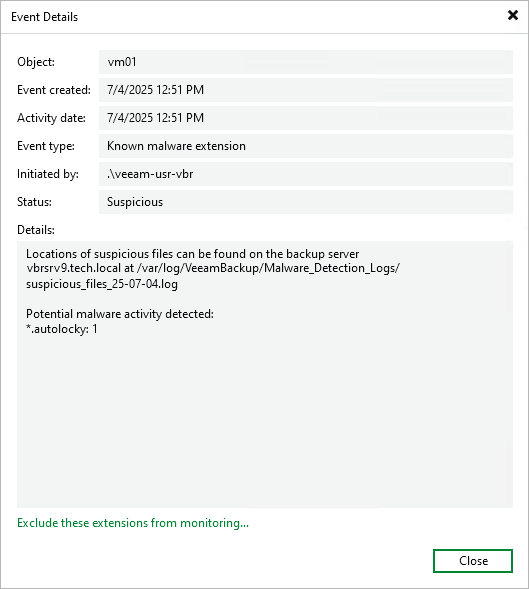

# Viewing Malware Detection Events

Information about malware detection sessions is displayed in the History view under the Malware Detection node. The Malware Detection > Malware Events subnode displays events created as a result of the following operations:

* Performing a backup job with the guest indexing data scan
* Performing a backup job with the inline scan
* Performing a Scan Backup session
* Performing a restore session with the Secure Restore option
* Performing a proactive signature-based scan
* Sending Veeam Incident API requests

|  |
| --- |
| Note |
| The Activity date column displays the creation date and time of the restore point where malware activity was detected for the first time. |

To view detailed information related to a specific malware detection event, do one of the following:

* In the working area, double-click the malware detection event.
* Select the malware detection event and click Details on the ribbon. Alternatively, right-click the event and select Details.

Events created during the guest indexing data scan include additional information:

* Paths to the log files that contain the list of detected suspicious files and extensions.
* Paths to the log files that contain the list of multiple files deleted by malware.

In the Event Details window, you can add detected suspicious files and extensions to the trusted list and ignore them during the next guest indexing data scans. To do this, click Exclude these extensions from monitoring. For more information on how to manage the list of suspicious files and extensions, see [Known Suspicious Files and Extensions](malware_detection_guest_index_suspicious_files.md).

