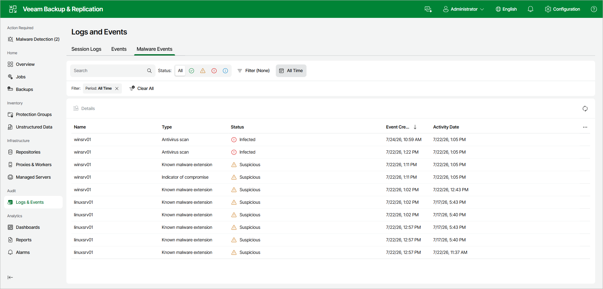

# Viewing Malware Detection Events Using Web UI

In the Veeam Backup & Replication web UI, malware detection events are displayed on the Malware Events tab of the Logs and Events view. To view malware detection events, do the following:

1. In the left navigation pane, click Logs & Events.
2. Open the Malware Events tab. For each event, the tab shows its Name, Type, Status, Event Created, and Activity Date. You can filter the list by status and time range, or search by object name.
3. To view detailed information about an event, select it and click Details.

Page updated 2026-07-23

