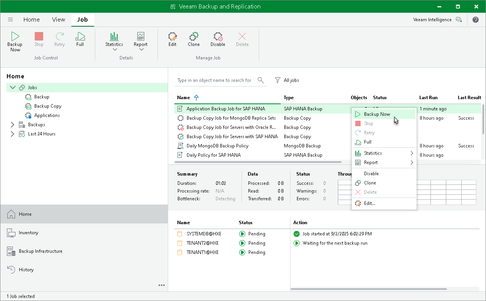

# Starting and Stopping Application Backup Policy

In this article

You can manually start an application backup policy. For example, if you want to create an additional restore point in the backup chain and do not want to change the backup schedule. You can also stop the backup process, for example, if processing of a computer is about to take long, and you do not want the backup process to produce workload on the production environment during business hours.

Veeam Backup & Replication does not check whether connection to computers is active at the time when the command is sent. Keep in mind that the start or stop operation will be performed only on those computers that received the command from the backup server.

Starting Application Backup Policy

To start an application backup policy on computers added to this backup policy:

1. Open the Home view.
2. In the inventory pane, select Jobs.
3. In the working area, select the backup policy and click Start on the ribbon or right-click the job and select Start.

|  |
| --- |
| TIP |
| You can also start a backup operation from the computer with installed Veeam Plug-In. To learn more, see [Starting Backup Job on Veeam Plug-In Side](manage_policy_start_job_from_vp.md). |

Stopping Application Backup Policy

To stop application backup policy on computers added to this backup policy:

1. Open the Home view.
2. In the inventory pane, select Jobs.
3. In the working area, select the backup policy and click Stop on the ribbon or right-click the job and select Stop. In the displayed window, click Yes.

Page updated 9/2/2025

Page content applies to build 13.0.1.1071
