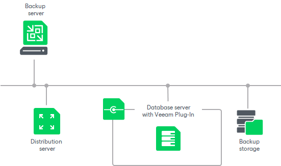
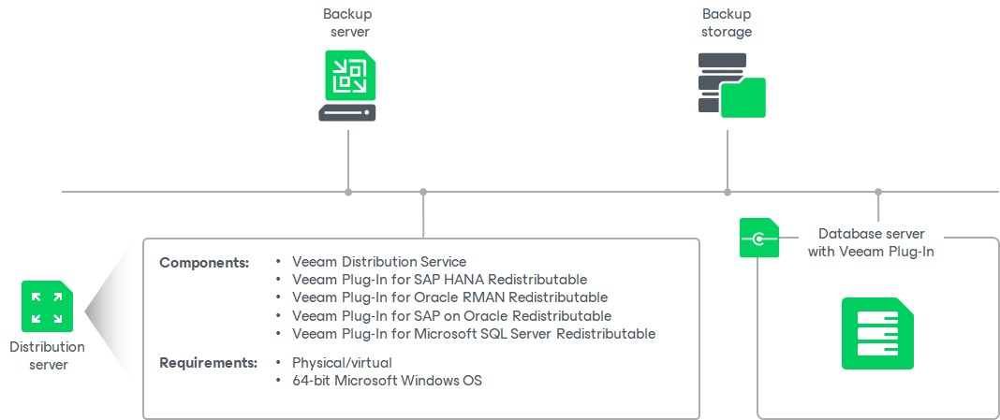

# Veeam Plug-In Management Infrastructure

In this article

The Veeam Plug-In management infrastructure comprises the following components:

* [Veeam backup server](#vbr)
* [Computers with Veeam Plug-Ins](#agent)
* [Distribution server](#distribution)
* [Backup storage](#storage)

Veeam Backup Server

The Veeam backup server is the core component in the backup infrastructure that fills the role of the “configuration and control center”. To use the Veeam Plug-In management functionality offered by Veeam Backup & Replication, you can use the backup server that is already running in your backup infrastructure or deploy a separate backup server.

For details, see [Deployment](deployment.md).

Computers with Veeam Plug-Ins

To manage Veeam Plug-Ins on computers in your infrastructure, you must add computers that you want to protect to the inventory in the Veeam Backup & Replication console and deploy Veeam Plug-Ins. In Veeam Backup & Replication, protected computers are organized into protection groups. To learn more, see [Protection Groups](protection_group_hiw.md).

The Veeam Backup & Replication console lets you manage Veeam Plug-In on computers running Microsoft Windows, Linux or Unix OSes.

Veeam Backup & Replication lets you manage Veeam Plug-In on computers of the following types:

* Workstations, servers and failover clusters running a Microsoft Windows OS
* Workstations servers and failover clusters running a Linux OS

To learn more, see [System Requirements](plan_and_manage_requirements.md).

If you want to manage Veeam Plug-Ins installed on protected computers in Veeam Backup & Replication, you must set Veeam Plug-Ins in the managed mode. In this mode, all data protection and administration tasks are performed by a user that has the Veeam Backup Administrator role or a custom role in Veeam Backup & Replication. To learn more, see [Managing Users and Roles](users_roles.md). In some scenarios, a user can also perform a limited set of backup and disaster recovery tasks directly on a protected computer.

Veeam Backup & Replication is set up to automatically discover computers added to the inventory and deploy Veeam Plug-Ins on these computers. To learn more, see [Computer Discovery and Veeam Plug-In Deployment](discovery_and_deployment.md).

On every computer added to the inventory, Veeam Backup & Replication installs the Veeam Installer Service. The service performs the following tasks:

* Collects information about the computer and sends it to Veeam Backup & Replication. The collected data includes details on the computer (platform, host name, guest OS, IP address, BIOS UUID), databases (database system name, database hierarchy, names of databases) and Veeam Plug-In (product presence on the computer and version).
* Downloads Veeam Plug-In setup files from the distribution server and installs Veeam Plug-In on the protected computer.
* Deploys Veeam Transport Service.

On Microsoft Windows computers, Veeam Backup & Replication connects to a computer using the administrative share (admin$) of the target computer. An account that you plan to use to connect to a computer included in the protection group must have access to the administrative share.

On Linux computers, for the first time, Veeam Backup & Replication connects to a computer using SSH. Keep in mind that to connect to a Linux computer using SSH, this Linux computer must be added to the list of trusted hosts. To learn more, see [Configuring Security Settings](security_settings.md). After the first connection, Veeam Backup & Replication connects using a Veeam Installer Service certificate. To learn more, see [Rescan Job](rescan_job.md).

Distribution Server

The distribution server is an architecture component in the Veeam Plug-In management infrastructure used for automated deployment of Veeam Plug-In setup files to protected computers. When you instruct Veeam Backup & Replication to install Veeam Plug-In on a protected computer, the Veeam backup server communicates to the distribution server, and Veeam Backup & Replication uploads Veeam Plug-In setup files from the distribution server to the target computer.

By default, the role of the distribution server is assigned to the backup server. However, you can deploy a dedicated distribution server to reduce workload on the backup server. To deploy a distribution server, you need to add a server to Veeam Backup & Replication. For details, see [Adding Microsoft Windows Servers](add_windows_server.md). After you assigned the role of distribution server, you need to select this server in the properties of a protection group. To learn more, see [Specify Discovery and Deployment Options](protection_group_options.md).

A machine performing the role of the distribution server must meet the following requirements:

* The role of the distribution server can be assigned to a physical or virtual machine.
* The machine must meet system requirements for backup server. For details, see [System Requirements](system_requirements.md#backup-server).
* You must add the machine to the Veeam Backup & Replication console as a managed server.

The distribution server comprises the following services and components:

* Veeam Distribution Service
* Veeam Plug-In for SAP HANA Redistributable
* Veeam Plug-In for Oracle RMAN Redistributable
* Veeam Plug-In for SAP on Oracle Redistributable

* Veeam Plug-In for Microsoft SQL Server Redistributable

Backup storage

The backup storage is an architecture component in the Veeam Plug-In management infrastructure used to store database backups. Veeam Plug-Ins can store backup files in supported repositories added to the Veeam Backup & Replication infrastructure. The list of supported repositories and limitations differs depending on the Veeam Plug-In you work with. To learn more, see the following sections:

* [Veeam Plug-In for Oracle RMAN](repos_rman.md)
* [Veeam Plug-In for SAP HANA](sap_repos.md)
* [Veeam Plug-In for SAP on Oracle](sap_orcl_repos.md)

* [Veeam Plug-In for Microsoft SQL Server](repos_mssql.md)

Page updated 11/17/2025

Page content applies to build 13.0.1.1071
