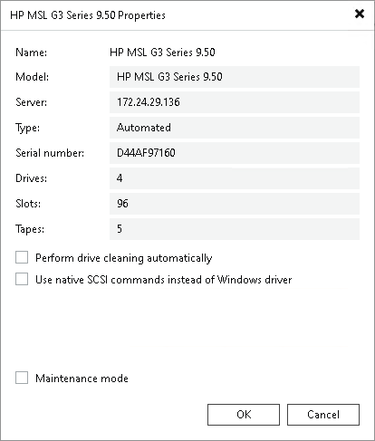

# Tape Libraries

All tape libraries and standalone tape drives managed by Veeam Backup & Replication are shown in a list under the Libraries node in the Tape Infrastructure view. All connected devices are discovered automatically during the rescan procedure. When you add a new tape device to the tape server, it appears in your console after rescanning.

To view properties of a tape device, open the Tape Infrastructure view, expand the Libraries node and select the needed item. Click Properties on the ribbon. You can also right-click the necessary device in the working area and select Properties.

Select the Perform drive cleaning automatically check box if you want Veeam Backup & Replication to manage the tape library drive cleaning. For more information about automated drives cleaning, see [Automated Drive Cleaning](auto_drive_cleaning.md).

[Available if the library is connected to a Windows-based tape server] Select the Use native SCSI commands instead of Windows driver check box if your library is an unknown media changer. For more information about unknown media changers, see [Supported Devices and Configuration](tape_supported_devices.md).

Related Topics

* [Rescanning Tape Devices](rescan_tape_library.md)
* [Renaming Tape Devices](renaming_library.md)
* [Removing Tape Devices](removing_tape_libraries.md)
* [Replacing Tape Devices](replacing_tape_library.md)
* [Loading Tapes](import_tapes.md)
* [Inventorying Tapes](inventoring_tapes.md)
* [Cataloging Tapes](cataloging_tapes.md)
* [Automated Drive Cleaning](auto_drive_cleaning.md)
* [Switching Libraries to Maintenance Mode](maintenance_mode.md)

