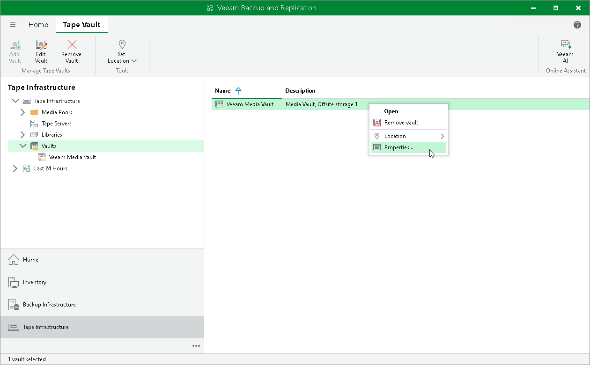

# Modifying Vaults

In this article

To modify vault settings:

1. Open the Tape Infrastructure view.
2. Navigate to the Vaults node.
3. Right-click the necessary vault and choose Properties. Alternatively, select a vault and click Edit Vault on the ribbon.
4. Go through the Edit Media Vault wizard to change the necessary settings.
5. Apply changes.

Page updated 7/10/2023

Page content applies to build 13.0.1.1071
