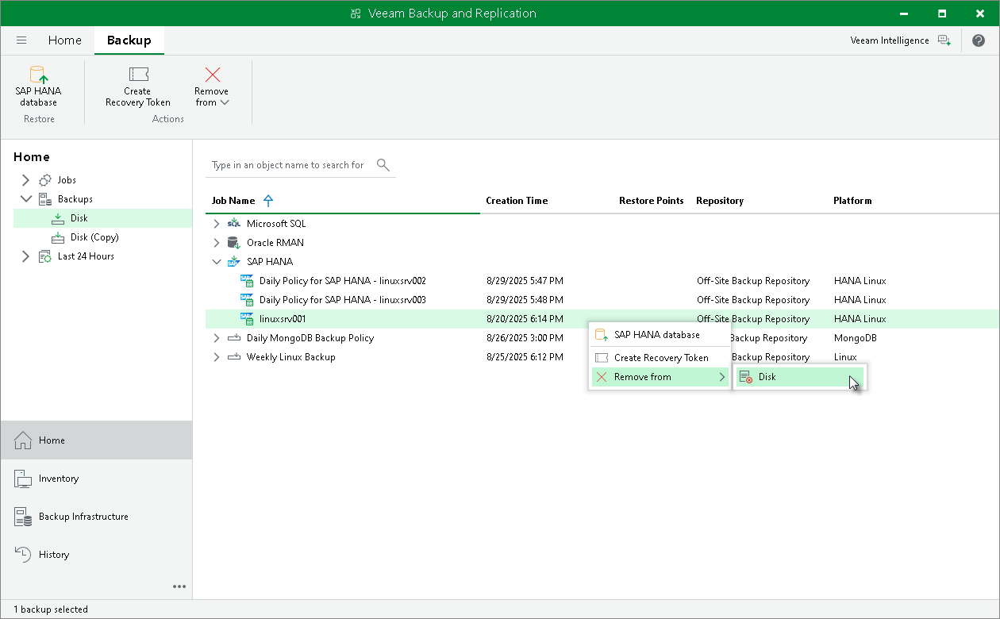

# Deleting Backups Manually

In this article

In the main scenario, when using Veeam Plug-In for SAP HANA, you must configure the retention policy using native SAP HANA tools. For details on the SAP HANA housekeeping options, see [Deleting Backups Using SAP HANA Tools](retention_sap_tools.md#studio).

If you have lost the backup catalog, you can delete the backups manually from Veeam backup repositories using the Veeam Backup & Replication console.

|  |
| --- |
| Note |
| If you remove backups from a backup repository manually, the backup catalog will not be updated. |

To remove a backup from a backup repository, do the following:

1. In the Veeam Backup & Replication console, open the Home view.
2. In the Inventory pane, select Backups.
3. In the working area, right-click the backup job object name and select Remove from > Disk.

Page updated 8/29/2025

Page content applies to build 13.0.1.1071
