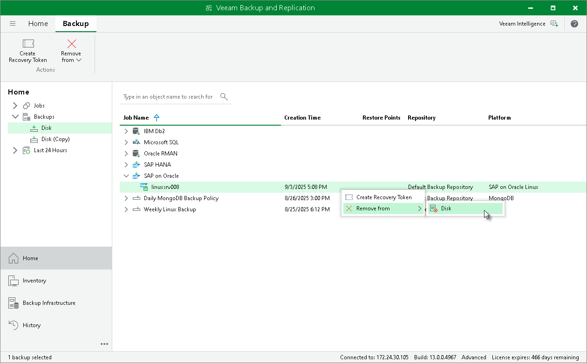

# Deleting Backups Manually

Apart from configuring the [retention policy](garbage_collector_sap_orcl.md), you can delete backups manually from backup repositories using the Veeam Backup & Replication console.

|  |
| --- |
| Note |
| If you remove backups from a backup repository manually, the backup catalog will not be updated. |

To remove a backup from a backup repository, do the following:

1. In the Veeam Backup & Replication console, open the Home view.
2. In the Inventory pane, select Backups.
3. In the working area, right-click the backup job object name and select Delete from disk.

