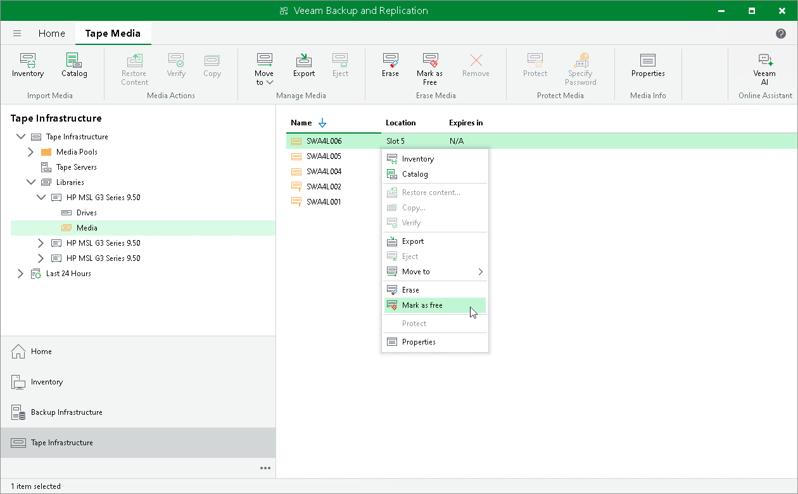

# Marking Tapes as Free

In this article

Instead of erasing tapes, you can mark tapes as free. During this operation, Veeam Backup & Replication deletes from backup and tape catalogs information about backup contents stored on tape. Data written to tape remains intact.

To mark tapes as free:

1. Open the Tape Infrastructure view.
2. Navigate to the list of tapes either under Media Pools or under Libraries > LibraryName node > Media > Online.
3. Select tapes you want to mark as free and click Mark as Free on the ribbon.

Alternatively, you can right-click selected tapes and select Mark as free from the drop-down menu.

1. In the displayed dialog box, click Yes.

After a tape is marked as free, Veeam Backup & Replication removes from the catalog information about contents on this tape.

If you want Veeam Backup & Replication to automatically reuse the tape for storing new backups, instead of just marking it as free, move it to the Free media pool, as described in section [Moving Tapes to Another Media Pool](moving_tapes_to_custom_pool.md).

|  |
| --- |
| Important |
| You cannot mark protected tapes as free. To mark such tapes as free, you need to switch the protection off first.  You cannot mark WORM tapes as free either. |

Page updated 6/14/2024

Page content applies to build 13.0.1.1071
