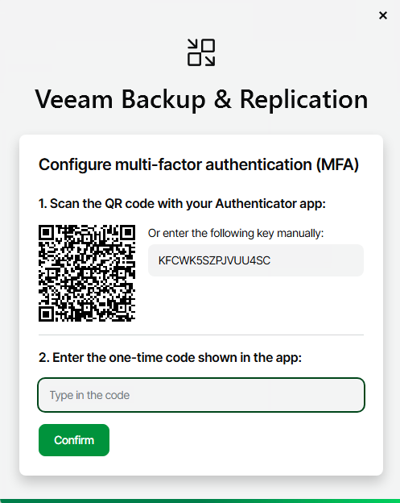
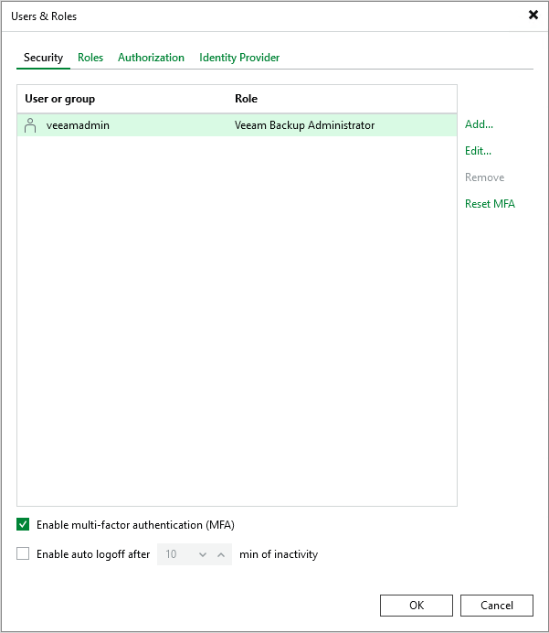
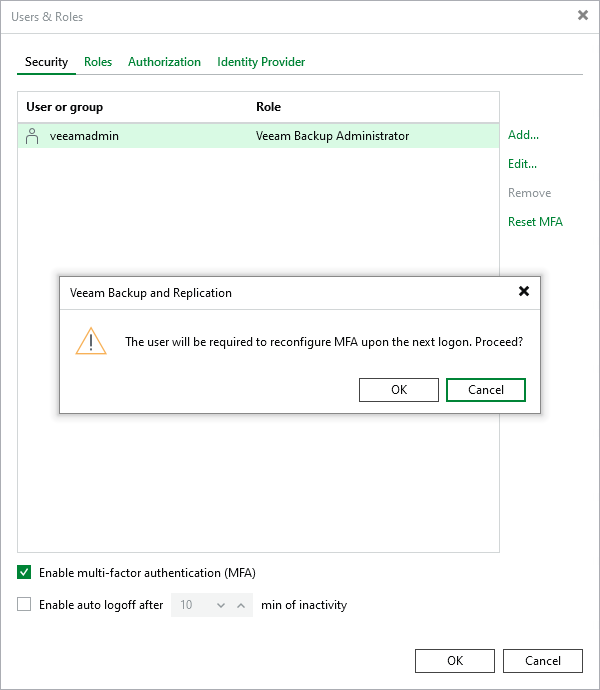
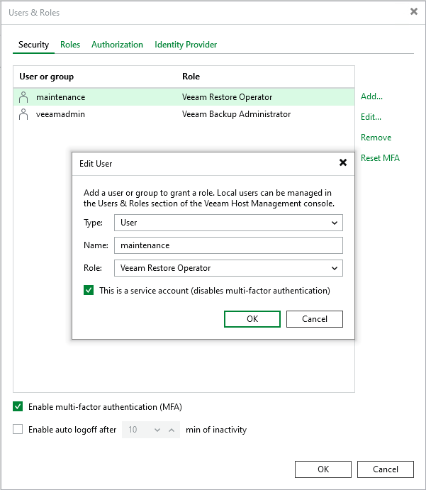

# Multi-Factor Authentication

Veeam Backup & Replication supports multi-factor authentication (MFA) for additional user verification. A one-time password (OTP) generated in a mobile authenticator application is used as a second verification method. Combined with login and password credentials, it creates a more secure environment and protects user accounts from being compromised.

The feature includes:

* Enabling/disabling MFA for all users
* Disabling MFA for service accounts
* Resetting MFA for specific users

|  |
| --- |
| Tip |
| Multi-factor authentication is compatible with mobile authentication applications that support [RFC4226](https://www.ietf.org/rfc/rfc4226.txt) and [RFC6238](https://datatracker.ietf.org/doc/html/rfc6238). |

Requirements and Limitations

MFA has the following requirements and limitations:

* Only users with the Veeam Backup Administrator role can manage MFA.
* MFA is not supported in the Veeam Backup & Replication Community Edition.
* MFA is not natively supported for Veeam Backup Enterprise Manager. It can be used with a third-party identity provider [specified in the SAML authentication settings](https://helpcenter.veeam.com/docs/vbr/em/veeam_backup_em_saml.html?ver=13).
* User groups are not supported. You can enable MFA only for user accounts.
* MFA is not supported for non-interactive connections used by the following applications and backup infrastructure components:

+ Veeam Backup & Replication REST API
+ Veeam Backup Enterprise Manager (for communication with the Veeam Backup & Replication server)
+ Veeam ONE agent (for communication with the Veeam Backup & Replication server)
+ Veeam Backup Validator

To avoid connection issues, you must disable MFA for the accounts used to run these applications and backup infrastructure components. For more information, see [Disabling MFA for Service Accounts](#disable_mfa_service_accounts).

* MFA is not supported for PowerShell (either interactive logon or non-interactive connections). To use PowerShell cmdlets with Veeam Backup PowerShell Module or Microsoft Windows PowerShell, run the Veeam Backup & Replication console or Microsoft Windows PowerShell under the service account with disabled MFA.
* To restore the configuration database properly, run the Veeam Backup & Replication console or Veeam Backup Configuration Restore application under the service account with disabled MFA.
* If a service provider (SP) uses Veeam Service Provider Console and wants to use multi-factor authentication on the SP backup server, they must set up a service account in Veeam Backup & Replication. For more information, see [this Veeam KB article](https://www.veeam.com/kb4431).
* Mobile push notifications are not supported. You can get an OTP code only in the mobile authenticator application.

How MFA Works

Veeam Backup & Replication supports the following scenario for MFA:

1. A user logs in to the Veeam Backup & Replication console.
2. Veeam Backup & Replication checks if MFA is enabled and configured for the user:

1. MFA is enabled but not configured. The user gets the instruction how to set up MFA. Veeam Backup & Replication generates a secret key which is used once for the initial setup in the mobile authenticator application. The hash of the secret key is also saved in the configuration database.

1. MFA is enabled and configured. Each time the user logs in they should enter a 6-digit confirmation code generated in the mobile authenticator application. Veeam Backup & Replication checks if the code is valid and, in case of success, starts a user session.

If there are more than 5 unsuccessful attempts, the user can reopen the console and try to log in again after waiting for at least one minute. If the problem persists, the backup administrator can [reset MFA](#reset_mfa) by request.

|  |
| --- |
| Important |
| The code confirmation works when there is no time shifting between the mobile authenticator application and the Veeam Backup & Replication server. Ensure that they are synchronized with the UTC time. Otherwise, the authentication will fail. |

If Veeam Explorers and other applications (except for Veeam Backup PowerShell Module) are started from the console, they do not require additional authentication.

Enabling MFA

To enable the feature for all users:

1. Log in to the Veeam Backup & Replication console as an administrator.
2. Go to Users and Roles > Security.
3. Remove user groups from the list if there are any. Leave only specific users.
4. Select the Enable multi-factor authentication (MFA) check box.
5. Click OK.

|  |
| --- |
| Important |
| If you generate a new backup server certificate while multi-factor authentication is enabled, any Veeam Backup & Replication consoles connected to the backup server must be restarted to avoid connection issues. |

Resetting MFA for Specific User

The backup administrator can reset MFA by user request if they have authentication issues, lose or change a mobile device with the mobile authentication application, and so on.

To reset MFA for a specific user:

1. Log in to the Veeam Backup & Replication console as an administrator.
2. Go to Users and Roles > Security.
3. Select the user and click Reset MFA. The next time the user logs in they will get the instruction how to set up MFA.

|  |
| --- |
| Note |
| If all backup administrators have multi-factor authentication issues with the Veeam Backup & Replication console, contact Veeam Support to restore access to the accounts. |

Disabling MFA

To disable the feature for all users:

1. Log in to the Veeam Backup & Replication console as an administrator.
2. Go to Users and Roles > Security.
3. Clear the Enable multi-factor authentication (MFA) check box.
4. Click OK.

Disabling MFA for Service Accounts

If you cannot use MFA due to limitations described in section [Requirements and Limitations](#requirements_and_limitations), you can disable this feature for specific service accounts used to run applications and backup infrastructure components.

To disable the feature for service accounts:

1. Log in to the Veeam Backup & Replication console as an administrator.
2. Go to Users and Roles > Security.
3. Select the service account and click Edit.
4. Select the This is a service account (disables two-factor authentication) check box.
5. Click OK.

