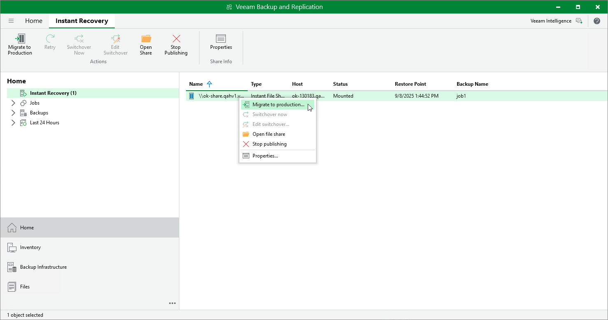

# Step 1. Launch Migrate to Production Wizard

To launch the Migrate to Production wizard, open the Home view. In the inventory pane, select Instant Recovery. In the working area, select the necessary published file share and do one of the following:

* In the Instant Recovery tab on the ribbon, click Migrate to Production.
* Right-click the file share that you want to migrate and select Migrate to Production.

