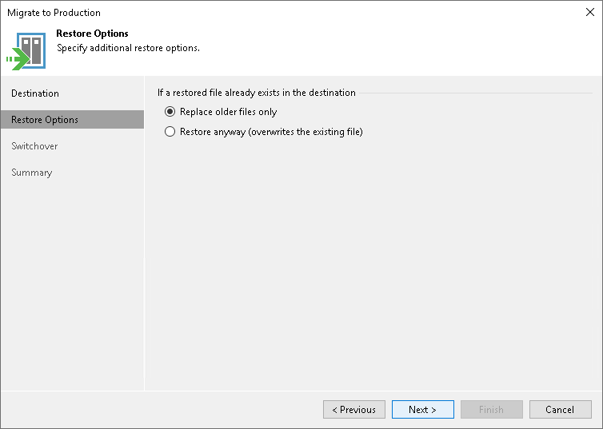

# Step 3. Specify Restore Options

In this article

At the Restore Options step of the wizard, specify overwrite options in case the file with the same name already exists in the destination:

* If you want to overwrite the existing files only if they are older than the restored files, select the Replace older files only option.
* If you want to restore the whole file share and overwrite the existing files with the restored files, select the Restore anyway (overwrites the existing file) option.

Page updated 6/3/2024

Page content applies to build 13.0.1.1071
