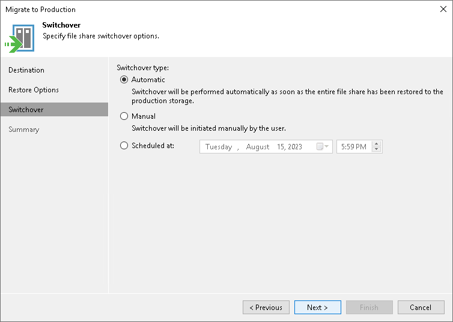

# Step 4. Specify Switchover Options

During migration to production, Veeam Backup & Replication moves to the production site not only content of the initial file share, but also incremental changes made by users in the mounted file share. When incremental changes are being moved, the mounted share is not available to users. We call this stage a switchover. The switchover may take some time, so ensure you properly plan when it is performed.

At the Switchover step of the wizard, specify file share switchover options:

* If you want Veeam Backup & Replication to perform the switchover automatically once the entire file share is migrated, select the Automatic option.
* If you want to perform the switchover manually after the entire file share is migrated, select the Manual option.

To launch the switchover manually, open the Home view. In the inventory pane, select Instant Recovery. In the working area, select the necessary published file share and do one of the following:

* In the Instant Recovery tab on the ribbon, click Switchover Now.
* Right-click the file share that you want to switch over to production and select Switchover now.

* If you want Veeam Backup & Replication to perform the switchover at a certain moment, select the Scheduled at option and specify when you want it to be done.

Before the scheduled switchover starts, you can edit the switchover time. To edit it, open the Home view. In the inventory pane, select Instant Recovery. In the working area, select the necessary published file share and do one of the following:

* In the Instant Recovery tab on the ribbon, click Edit Switchover.
* Right-click the file share that you want to update the switchover time for and select Edit switchover.

