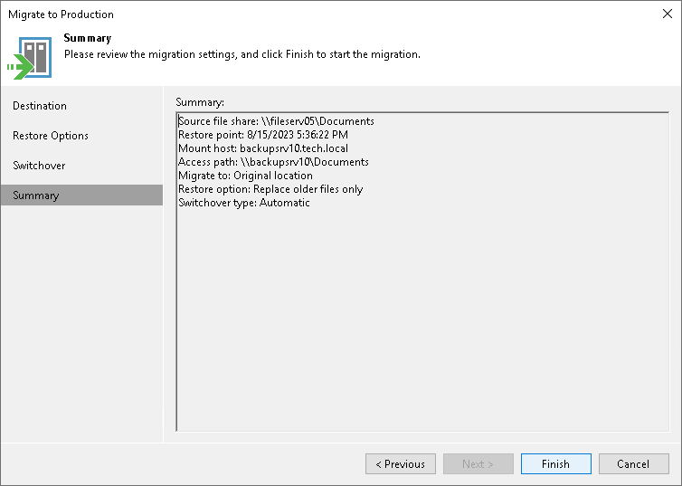

# Step 5. Finish Working with Wizard

In this article

At the Summary step of the wizard, review the migration to production settings and click Finish. Veeam Backup & Replication will migrate the selected file share to the specified production destination.

Page updated 1/25/2024

Page content applies to build 13.0.1.1071
