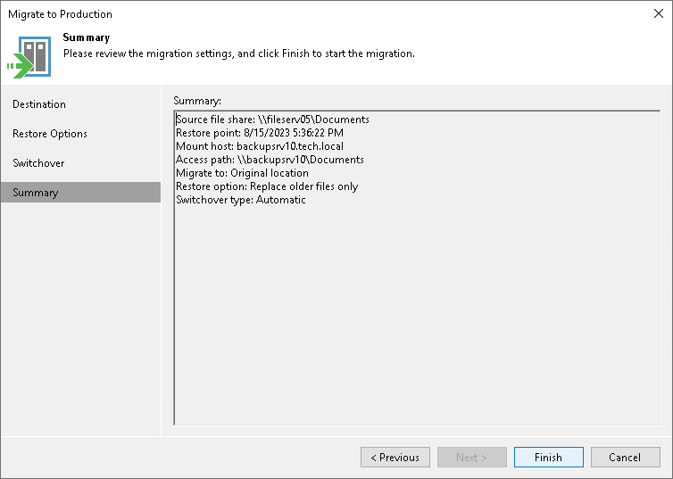

# Step 5. Finish Working with Wizard

At the Summary step of the wizard, review the migration to production settings and click Finish. Veeam Backup & Replication will migrate the selected file share to the specified production destination.

