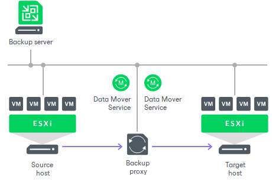
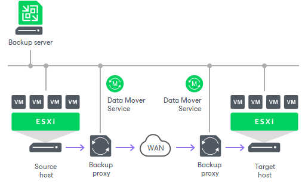

# Quick Migration Architecture

In this article

Quick Migration architecture in a VMware vSphere environment comprises the following components:

* Source host and target host with associated datastores
* One or two backup proxy servers

Similar to the backup architecture, Quick Migration uses two-service architecture: the source-side [Veeam Data Mover](veeam_transport_service.md) interacts with the source host, and the target-side Veeam Data Mover interacts with the target host. To perform on-site migration, you can deploy one backup proxy for data processing and transfer. This backup proxy must have access to the source host and to the target host at the same time. In this scenario, the source-side Veeam Data Mover and the target-side Veeam Data Mover are started on the same backup proxy.

The common requirement for off-site migration is that one Veeam Data Mover runs in the production site (closer to the source host and datastore), and the other Veeam Data Mover runs in the remote target site (closer to the target host and datastore). During backup, Veeam Data Movers maintain a stable connection, which allows for uninterrupted operation over WAN or slow links.

For off-site migration, you need to deploy at least one local backup proxy in each site: a source backup proxy in the production site, and a target backup proxy in the remote target site.

Page updated 1/25/2024

Page content applies to build 13.0.1.1071
