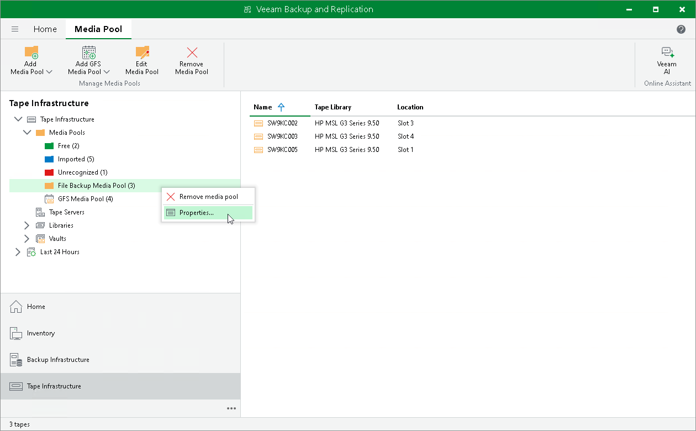

# Modifying Media Pools

In this article

If necessary, you can modify settings of a media pool.

To modify media pool settings:

1. Open the Tape Infrastructure view.
2. Navigate to the Media Pool node.
3. Right-click the necessary media pool and choose Properties. Alternatively, select a media pool and click Edit Media Pool on the ribbon.
4. Go through the Edit Media Pool wizard to change the necessary settings.
5. Apply changes.

Limitations for Modifying Media Pools

You can modify only regular or GFS media pools; service media pools cannot be modified.

Page updated 7/10/2023

Page content applies to build 13.0.1.1071
