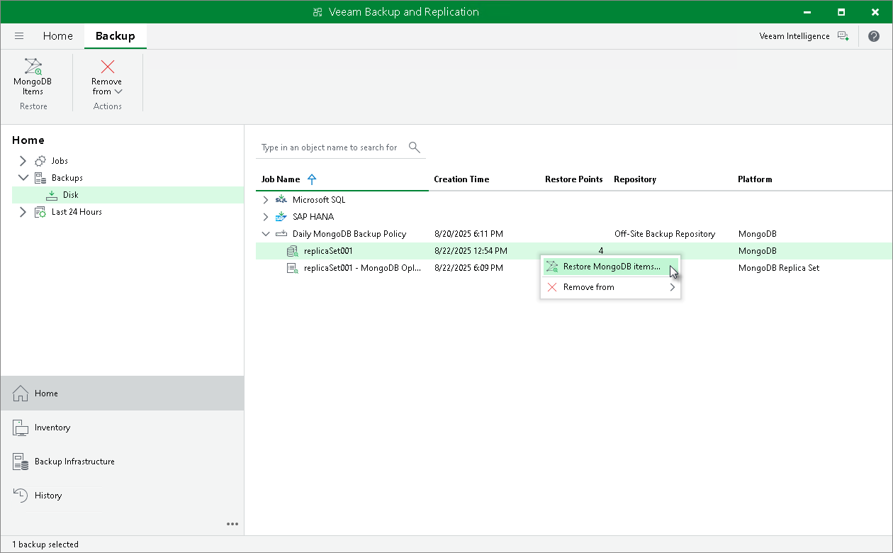

# Step 1. Launch MongoDB Items Restore Wizard

To launch database from an application backup:

1. Open the Home view.
2. In the inventory pane, click Backups.
3. In the working area, select the MongoDB backup, then click MongoDB Items on the ribbon or right-click the backup and select Restore MongoDB items.

