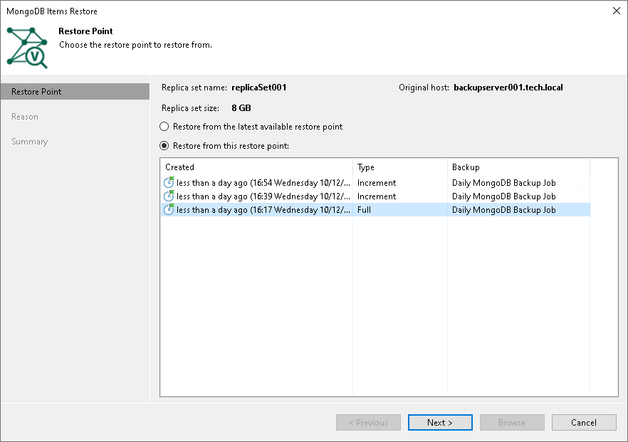

# Step 2. Select Restore Point

In this article

At the Restore Point step of the wizard, select a restore point from which you want to recover data.

By default, Veeam Backup & Replication selects the the latest restore point. If you want to select another restore point, select the Restore from this restore point option and select any valid restore point to recover data.

Page updated 12/10/2025

Page content applies to build 13.0.1.1071
