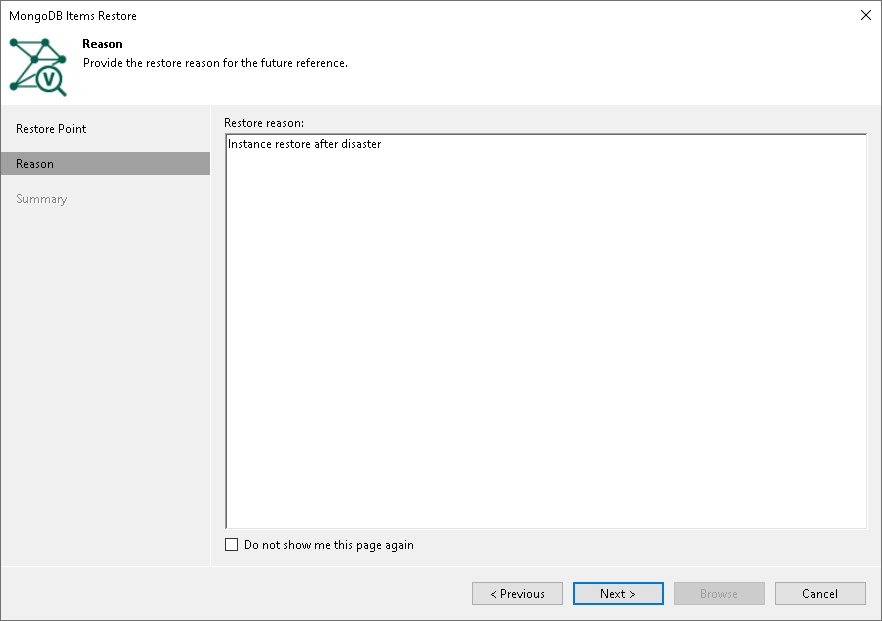

# Step 3. Specify Restore Reason

In this article

At the Reason step of the wizard, enter a reason for restoring the instance.

|  |
| --- |
| Tip |
| If you do not want to display the Reason step of the wizard in future, select the Do not show me this page again check box. |

Page updated 12/10/2025

Page content applies to build 13.0.1.1071
