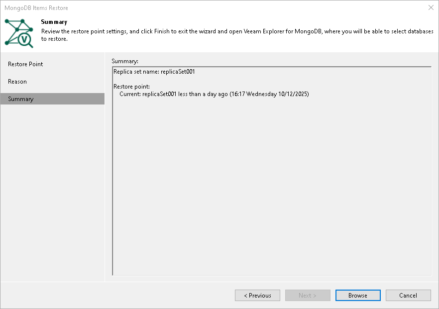

# Step 4. Complete Restore Process

In this article

At the Summary step of the wizard, review the settings and launch Veeam Explorer for MongoDB.

1. Review settings of the restore process.
2. Click Browse to start the recovery process with Veeam Explorer for MongoDB. For details on Veeam Explorer, see [Data Restore](vemdb_restore.md).

Page updated 12/10/2025

Page content applies to build 13.0.1.1071
